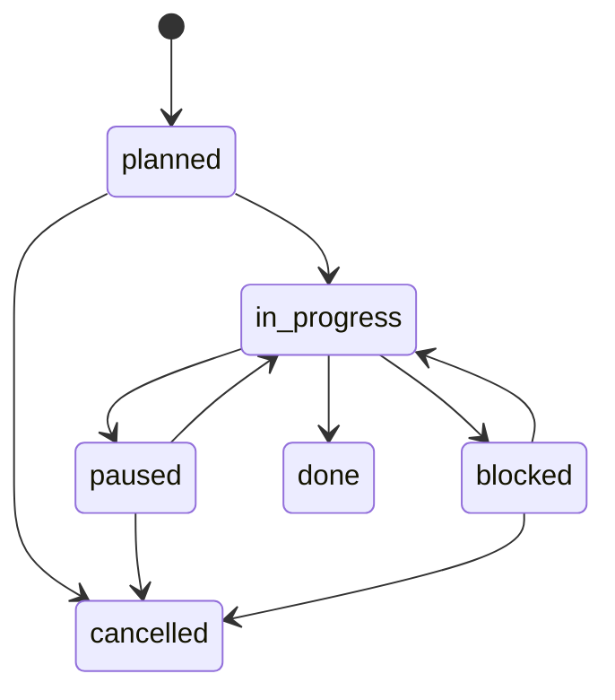

# Roadmap task format

Read this reference whenever adding tasks or changing task state in `docs/product/roadmap.md`.

## ID allocation

The roadmap header stores the next unallocated ID:

```markdown
> Next task ID: `CP-0059`
```

Run `validate_roadmap.py --next-id` to read this counter. When allocating one or more IDs, assign consecutive values from the counter and advance it past the last allocated value in the same edit. Never lower the counter, including after a task is cancelled, removed, or moved to another phase.

## Canonical task line

```markdown
- [ ] `CP-0001` `planned` — Define the database requirements.
```

Use exactly one of these statuses:

| Status | Checkbox | Meaning |
| --- | --- | --- |
| `planned` | `[ ]` | Ready or waiting on declared dependencies |
| `in-progress` | `[ ]` | Actively being worked on |
| `paused` | `[ ]` | Intentionally interrupted by other work |
| `blocked` | `[ ]` | Cannot proceed until an external condition changes |
| `done` | `[x]` | Outcome verified and evidence recorded |
| `cancelled` | `[x]` | Will not be completed; reason recorded |

## Optional and conditional metadata

Indent metadata by two spaces beneath its task.

```markdown
- [ ] `CP-0012` `planned` — Run a database comparison PoC.
  - Depends on: `CP-0010`, `CP-0011`
  - Done when: The same workload and measurements are recorded for both candidates.
```

Use these exact labels so the validator can interpret them:

- `Depends on`: zero or more existing task IDs.
- `Done when`: observable completion criteria when the task line alone is insufficient.
- `Resume`: current artifacts, completed work, and the next concrete action.
- `Pause reason`: why an in-progress task was interrupted.
- `Blocker`: the condition preventing progress.
- `Resume when`: the observable condition that clears a blocker.
- `Evidence`: test output, document, commit, or other verification for a done task.
- `Cancellation reason`: why a task will not be completed.

## State transitions



When changing status:

- `in-progress` requires `Resume` so another session can continue the work.
- `paused` requires both `Pause reason` and `Resume`.
- `blocked` requires both `Blocker` and `Resume when`.
- `done` requires `Evidence` and must not depend on unfinished tasks.
- `cancelled` requires `Cancellation reason`.

Remove metadata that no longer describes the current status, while preserving useful evidence or links in the task history where appropriate.

## Interrupting a task

Before starting the interrupting task:

1. Change the current task from `in-progress` to `paused`.
2. Add `Pause reason` naming the interrupting outcome, preferably with its new ID.
3. Update `Resume` with what is complete, where the artifacts are, and the next command or edit.
4. Allocate a new ID for the interrupting task.
5. Add explicit dependencies without renumbering or moving unrelated tasks.

Example:

```markdown
- [ ] `CP-0020` `paused` — Implement the first source adapter.
  - Pause reason: `CP-0021` must fix fixture licensing before more samples are added.
  - Resume: Fetch is complete; continue parser work in `src/.../parser.py` after CP-0021.
- [ ] `CP-0021` `in-progress` — Confirm fixture storage and redistribution terms.
  - Resume: Check the source terms URL recorded in `docs/sources/example.md`.
```

## Splitting tasks

Split a task when its outcomes can be completed and reviewed independently, when research must precede a decision, or when one part can proceed while another is blocked.

- Keep the original ID for the outcome that best matches the original wording.
- Give every new sibling or child a fresh global ID.
- Add dependencies that express the actual order.
- Separate research, decision, implementation, and validation when uncertainty makes them meaningfully different outcomes.
- Do not split solely to create a preferred number of tasks.
- Do not duplicate the parent outcome across every child.

## Moving and removing tasks

- Moving a task between phases never changes its ID.
- Reordering tasks never changes their IDs.
- Cancellation retains the ID and reason.
- If detailed execution moves to an issue or task document, keep the roadmap ID and link to the new location.
