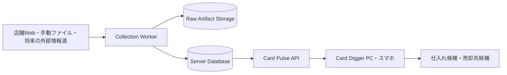
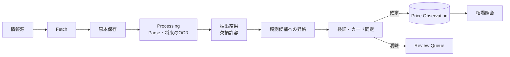

# Card Pulse

Card Pulse は、複数の情報源からTCGカードの価格観測値を継続的に保存し、仕入れ候補と売却先を評価するための個人用データ基盤です。プロジェクトオーナー本人だけが使い、アプリ、API、取得データを一般公開しません。

現在は構想・設計段階です。最初に証明するのは完全自動収集の実現性ではなく、次の3点です。

1. 異なる情報源の価格を、出典を失わず同じ形式で蓄積できること。
2. 同じカードを十分な精度で同定し、店舗差と時系列変化を比較できること。
3. 蓄積した情報が、仕入れ判断または売却先判断に実際に役立つこと。

## Card Diggerとの関係

Card PulseはCard Diggerから独立したシステムとして扱います。

| システム | 責務 |
| --- | --- |
| Card Digger | フリマ商品を発見・分析し、確認する価値の高い商品を提示する |
| Card Pulse | カード価格を収集・保存・正規化・集計し、根拠と鮮度を伴う相場情報を提供する |



Card DiggerはCard Pulseの内部DBを直接参照せず、本人の端末またはprivate network内のAPIを利用します。API、Collection Worker、DBは別サービスとして扱いますが、いずれもInternetへ公開しません。APIの具体的な識別子、認証、versioning、鮮度、欠損、曖昧一致の契約は実装前に定義します。

## MVP

MVPは小さな縦方向の処理を完成させ、2〜4週間の試験収集で価値を判定します。

| 項目 | 対象 |
| --- | --- |
| TCG | ポケモンカードゲーム |
| 情報源 | 晴れる屋2、遊々亭、フルコンプ池袋店。本人のローカル環境から低頻度で取得 |
| 補助入力 | CSVまたはJSONによる手動取込1系統 |
| 優先する価格 | 買取価格 |
| 永続化 | 比較検証後に選定するサーバー型DB。原本storageはDBと分離 |
| 提供 | 最新価格、中央値、最高値、店舗数、鮮度、価格履歴を返す非公開API |
| 実行 | APIとCollection Workerを別サービスとして本人の端末またはprivate network内で実行 |
| ローカル開発 | Docker Composeでサービス構成を再現 |

Xの全自動監視、画像によるカード同定、全TCG・全店舗対応、リアルタイム更新、高可用性・自動拡張を備えた本番運用、一般公開、第三者提供、Card Digger UIはMVPに含めません。詳しい範囲と完了条件は [MVP定義](docs/product/mvp.md) を参照してください。

## 設計原則

- 取得原本と確定した価格観測値を追記型で保存する。
- source、原本メタデータ、processor version、同定規則から結果を追跡できるようにする。
- 取得と解析を分け、保存済み原本から再解析できるようにする。
- 欠損を許す抽出結果、価格候補、同定試行、確定観測を分け、各段階を原本から追跡できるようにする。
- 情報源固有の仕様をsource adapter内に閉じ込め、domain、application、永続化、API、他sourceへ漏らさない。境界の詳細は[情報源adapterの境界](docs/architecture/overview.md#情報源adapterの境界)に従う。
- 同一入力の再実行で観測値を重複させない。
- カード同定が曖昧なデータは確定値に混ぜず、レビュー待ちにする。
- 取得失敗、正常な0件、古いデータ、価格0円を区別する。
- 一つの情報源が停止しても、保存済みデータの照会と他の情報源の取得を継続できるようにする。
- source由来の原本、fixture、抽出値、価格履歴を本人の管理領域だけに保存し、Gitや公開CIへ含めない。

## データの流れ



不完全な解析結果は中間段階へ保存し、比較に必要な条件とカード同定が確定した結果だけを価格観測へ昇格させます。構造化データは情報源ごとのDBに分けず、一つの論理的なsystem of record内で処理段階ごとに分離します。

Collectorの境界は [Collector契約](docs/contracts/collector.md)、エンティティと不変条件は [データモデル](docs/architecture/data-model.md)、この構成を選んだ理由は [ADR-0007](docs/adr/0007-layered-ingestion-data.md) に記載します。

## ドキュメント

文書は目的ごとに分けます。現在の仕様と判断は `product`、`architecture`、`contracts`、`adr` を正とし、`research` は調査時点の資料として扱います。

| 場所 | 内容 |
| --- | --- |
| [プロダクト構想](docs/product/vision.md) | 目的、利用者、Card Diggerとの責務分担 |
| [MVP定義](docs/product/mvp.md) | 対象範囲、対象外、完了条件 |
| [ロードマップ](docs/product/roadmap.md) | 検証と開発の順序 |
| [用語集](docs/domain/glossary.md) | ドメイン用語の共通定義 |
| [アーキテクチャ概要](docs/architecture/overview.md) | システム境界、レイヤ、データフロー |
| [データモデル](docs/architecture/data-model.md) | エンティティ、関係、不変条件 |
| [DB要件](docs/architecture/database-requirements.md) | 容量、同時実行、整合性、backup・復旧、運用、費用の選定基準 |
| [Collector契約](docs/contracts/collector.md) | 情報源adapterの入出力と失敗規則 |
| [情報源マップ](docs/sources/source-map.md) | 候補情報源の比較と選定状況 |
| [ADR](docs/adr/README.md) | 採用した設計判断と理由 |
| [Research](docs/research/README.md) | 構想・調査時点の資料 |
| [Runbooks](docs/runbooks/README.md) | 運用、障害対応、復元手順 |
| [Experiments](docs/experiments/README.md) | 試験収集の結果と継続判断 |
| [Learning](docs/learning/README.md) | 設計判断を理解するための学習資料 |

## エージェント設定

このリポジトリはOpenAI CodexとClaude Codeの両方で開発します。2つのツールは読み取るパスが異なるため、共有できるものは1箇所に置き、ツール固有の形式が必要なものだけを生成または symlink で各ツールへ渡します。

| ディレクトリ | 役割 | 読むツール |
| --- | --- | --- |
| `.agents/` | Skillとエージェント定義の実体。SKILL.md標準の共有置き場 | Codexが直接読む。Claude Codeは `.claude/skills/` のsymlink経由 |
| `.codex/` | Codex専用。`config.toml` と生成されたsubagent定義 | Codexのみ |
| `.claude/` | Claude Code専用。設定、生成されたsubagent定義、`.agents/skills/` へのsymlink | Claude Codeのみ |

Skillが `.agents/` の共有で、subagentがツールごとに分かれているのは、両ツールの探索パスの違いによります。Skillは `.agents/skills/` がCodex側の標準パスなので実体を1つ置いてClaude Codeを symlink で合流させられますが、subagentには共通の置き場が無いため、`.agents/agents/` の中立定義から各ツールの形式へ生成します。リポジトリ指示は `AGENTS.md` が正で、`CLAUDE.md` が `@AGENTS.md` で取り込みます。

| Skill | 用途 |
| --- | --- |
| [`check-doc-links`](.agents/skills/check-doc-links/SKILL.md) | Markdownの内部ファイル・画像・見出しanchorを検査する |
| [`maintain-roadmap`](.agents/skills/maintain-roadmap/SKILL.md) | 安定ID、状態、依存関係、割り込み・再開を保ってroadmapを更新する |
| [`write-project-docs`](.agents/skills/write-project-docs/SKILL.md) | 文書種別とsource of truthに従ってプロジェクト文書を作成・改訂する |
| [`maintain-tool-parity`](.agents/skills/maintain-tool-parity/SKILL.md) | エージェント定義とSkillを両ツールへ反映し、乖離を検査する |

Skillは反復作業の手順を定義し、検査スクリプトは決定的な結果を返します。CIでも同じスクリプトを呼び出し、Skillの発動有無やツールの違いに依存せず検査します。

DBの列定義はマイグレーション、内部データ契約はコード上の型、外部入出力は `schemas/` の機械可読な定義を正とします。Markdownには、それらの意味、不変条件、変更理由を記録します。

## 開発ディレクトリ

MVPは単一のPythonパッケージによるモジュラーモノリスとして開始します。ディレクトリは責務の境界を表し、実装が必要になった時点でファイルを追加します。

```text
card-pulse/
├── .agents/                    # Skillとエージェント定義の実体。両ツールで共有
├── .codex/                     # Codex専用の設定と生成されたsubagent定義
├── .claude/                    # Claude Code専用の設定、生成物、Skillへのsymlink
├── docs/                       # プロダクト、設計、判断、運用の文書
├── config/                     # 実行設定の例。秘密情報は置かない
├── src/card_pulse/
│   ├── domain/                 # 価格観測、カード同定、出典の業務ルール
│   ├── application/            # 取込、レビュー、照会のユースケースとport
│   ├── adapters/
│   │   ├── sources/            # 店舗・手動取込など情報源固有の実装
│   │   ├── persistence/        # 選定したDBの永続化実装
│   │   └── artifacts/          # 取得原本の保存実装
│   └── entrypoints/
│       ├── api/                 # 本人のCard Digger等から利用する非公開API
│       ├── worker/              # 収集・解析job
│       └── cli/                 # 開発・運用コマンド
├── migrations/                 # DBスキーマ変更
├── schemas/                    # 外部入出力のバージョン付きschema
├── tests/
│   ├── unit/
│   ├── integration/
│   ├── contract/
│   └── fixtures/sources/       # CIで使うsource非由来の合成サンプル
├── scripts/                    # セットアップ・保守用スクリプト
└── var/                        # 原本、DB、ログ、レビュー対象。Git管理外
```

ローカル開発にはDocker Composeを使い、API、Worker、DB、artifact storageの接続関係と依存versionを一つの手順で再現します。Dockerが再現できる範囲と限界は [Dockerによる環境再現](docs/learning/docker-environment-reproduction.md) を参照してください。

ソースコード、Docker環境、DBマイグレーションはまだありません。取得経路は`CP-0074`で確定したため、次の作業は [ロードマップ](docs/product/roadmap.md) のPhase 1でPython基盤、DB選定、ローカル開発環境を整えることです。
