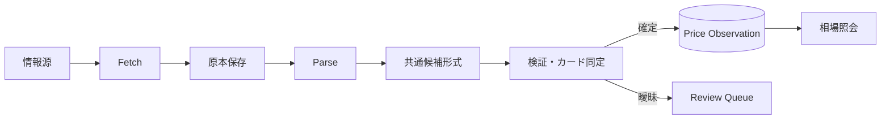

# Card Pulse

Card Pulse は、複数の情報源からTCGカードの価格観測値を継続的に保存し、仕入れ候補と売却先を評価するための相場情報を提供するデータ基盤です。

現在は構想・設計段階です。最初に証明するのは完全自動収集の実現性ではなく、次の3点です。

1. 異なる情報源の価格を、出典を失わず同じ形式で蓄積できること。
2. 同じカードを十分な精度で同定し、店舗差と時系列変化を比較できること。
3. 蓄積した情報が、仕入れ判断または売却先判断に実際に役立つこと。

## Card Diggerとの関係

Card PulseはCard Diggerから独立したシステムとして扱います。

| システム | 責務 |
| --- | --- |
| Card Digger | フリマ商品を発見・分析し、確認する価値の高い商品を提示する |
| Card Pulse | カード価格を収集・保存・正規化・集計し、根拠と鮮度を伴う相場情報を提供する |


Card DiggerはCard Pulseの内部DBを直接参照しません。相場データの有用性を確認した後、識別子、鮮度、欠損、曖昧一致を含む利用契約を定義します。

## MVP

MVPは小さな縦方向の処理を完成させ、2〜4週間の試験収集で価値を判定します。

| 項目 | 対象 |
| --- | --- |
| TCG | 情報源調査で選ぶ1種類 |
| 店舗 | 構造化されたWeb情報源2〜3店舗 |
| 補助入力 | CSVまたはJSONによる手動取込1系統 |
| 優先する価格 | 買取価格 |
| 永続化 | SQLiteとファイルシステム上の原本 |
| 出力 | 最新価格、中央値、最高値、店舗数、鮮度、価格履歴 |
| 実行 | ローカルで再現可能なCLIと定期実行想定 |

Xの全自動監視、画像によるカード同定、全TCG・全店舗対応、リアルタイム更新、クラウド運用、Card Digger UIはMVPに含めません。詳しい範囲と完了条件は [MVP定義](docs/product/mvp.md) を参照してください。

## 設計原則

- 取得原本と確定した価格観測値を追記型で保存する。
- URL、情報源内ID、公開日時、取得日時、content hash、parser versionから結果を追跡できるようにする。
- 取得と解析を分け、保存済み原本から再解析できるようにする。
- 情報源固有の仕様をsource adapter内に閉じ込める。
- 同一入力の再実行で観測値を重複させない。
- カード同定が曖昧なデータは確定値に混ぜず、レビュー待ちにする。
- 取得失敗、正常な0件、古いデータ、価格0円を区別する。
- 一つの情報源が停止しても、保存済みデータの照会と他の情報源の取得を継続できるようにする。

## データの流れ



Collectorの境界は [Collector契約](docs/contracts/collector.md)、エンティティと不変条件は [データモデル](docs/architecture/data-model.md) に記載します。

## ドキュメント

文書は目的ごとに分けます。現在の仕様と判断は `product`、`architecture`、`contracts`、`adr` を正とし、`research` は調査時点の資料として扱います。

| 場所 | 内容 |
| --- | --- |
| [プロダクト構想](docs/product/vision.md) | 目的、利用者、Card Diggerとの責務分担 |
| [MVP定義](docs/product/mvp.md) | 対象範囲、対象外、完了条件 |
| [ロードマップ](docs/product/roadmap.md) | 検証と開発の順序 |
| [用語集](docs/domain/glossary.md) | ドメイン用語の共通定義 |
| [アーキテクチャ概要](docs/architecture/overview.md) | システム境界、レイヤ、データフロー |
| [データモデル](docs/architecture/data-model.md) | エンティティ、関係、不変条件 |
| [Collector契約](docs/contracts/collector.md) | 情報源adapterの入出力と失敗規則 |
| [情報源マップ](docs/sources/source-map.md) | 候補情報源の比較と選定状況 |
| [ADR](docs/adr/README.md) | 採用した設計判断と理由 |
| [Research](docs/research/README.md) | 構想・調査時点の資料 |
| [Runbooks](docs/runbooks/README.md) | 運用、障害対応、復元手順 |
| [Experiments](docs/experiments/README.md) | 試験収集の結果と継続判断 |

DBの列定義はマイグレーション、内部データ契約はコード上の型、外部入出力は `schemas/` の機械可読な定義を正とします。Markdownには、それらの意味、不変条件、変更理由を記録します。

## 開発ディレクトリ

MVPは単一のPythonパッケージによるモジュラーモノリスとして開始します。ディレクトリは責務の境界を表し、実装が必要になった時点でファイルを追加します。

```text
card-pulse/
├── docs/                       # プロダクト、設計、判断、運用の文書
├── config/                     # 実行設定の例。秘密情報は置かない
├── src/card_pulse/
│   ├── domain/                 # 価格観測、カード同定、出典の業務ルール
│   ├── application/            # 取込、レビュー、照会のユースケースとport
│   ├── adapters/
│   │   ├── sources/            # 店舗・手動取込など情報源固有の実装
│   │   ├── persistence/        # SQLiteなどの永続化実装
│   │   └── artifacts/          # 取得原本の保存実装
│   └── entrypoints/            # CLI、将来のscheduler/API
├── migrations/                 # DBスキーマ変更
├── schemas/                    # 外部入出力のバージョン付きschema
├── tests/
│   ├── unit/
│   ├── integration/
│   ├── contract/
│   └── fixtures/sources/       # 許可された固定サンプル
├── scripts/                    # セットアップ・保守用スクリプト
└── var/                        # 原本、DB、ログ、レビュー対象。Git管理外
```

ソースコード、実行環境、DBマイグレーションはまだありません。次の作業は [ロードマップ](docs/product/roadmap.md) のPhase 0に従い、情報源候補の調査とMVP対象の選定です。
