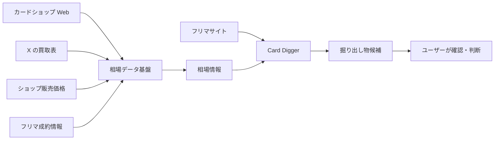
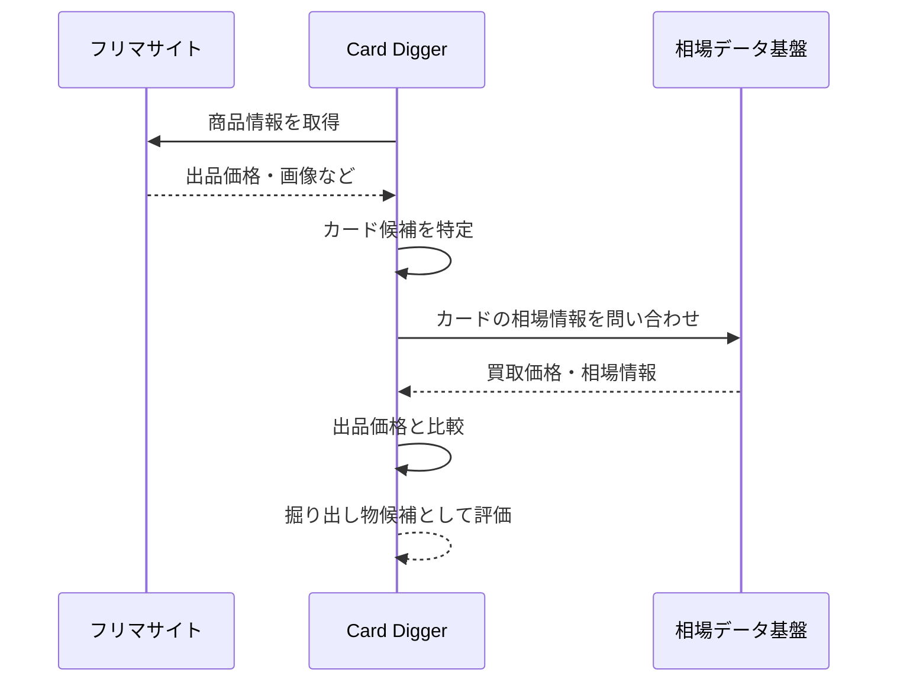
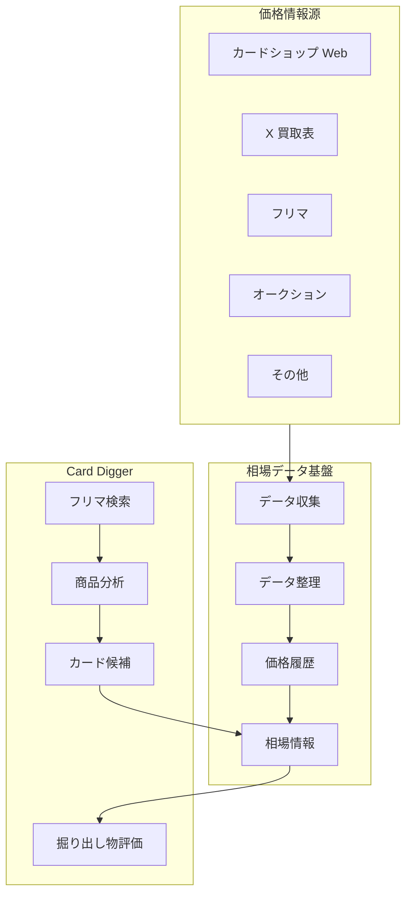
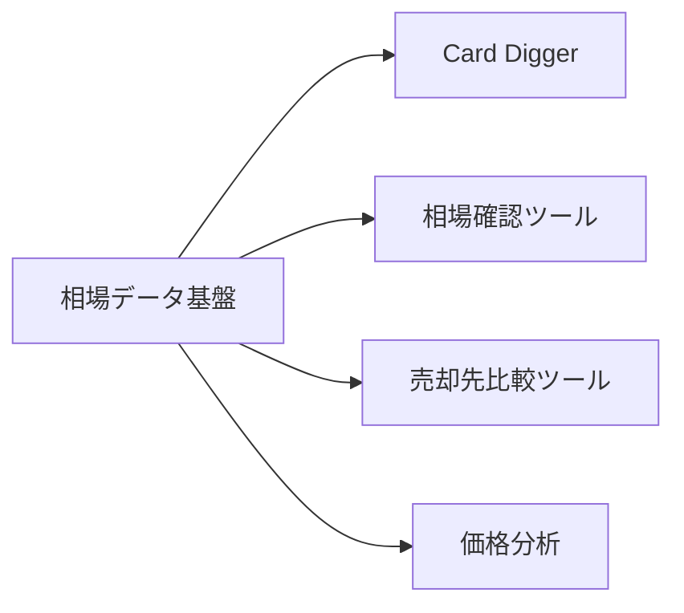

# Card Digger と相場データ基盤の連携構想

## 1. このドキュメントの目的

本ドキュメントでは、現在開発中の **Card Digger** と、今後検討している **相場データ基盤** の役割分担や連携イメージを整理する。

現時点ではまだ構想段階であり、具体的なAPI仕様、DBスキーマ、機能一覧などを確定するものではない。

目的は、今後の開発・調査を進めるうえで、

- 何を Card Digger が担当するのか
- 何を相場データ基盤が担当するのか
- 両者をどのように連携させるのか
- 今後どのような方向で検討を進めるのか

を大まかに整理することである。

---

## 2. 背景

現在、Card Digger では、フリマサイトなどに出品されているカード関連商品から、掘り出し物を効率よく探す仕組みを検討している。

一方で、商品が「安いか」「買う価値があるか」を判断するためには、出品価格を見るだけでは不十分である。

判断材料として、例えば以下のような情報が必要になる。

- カードショップの買取価格
- 店舗ごとの買取価格差
- ショップの販売価格
- フリマサイトの出品価格
- フリマサイトの成約価格
- 過去から現在までの価格推移
- そのカードを買い取っている店舗数
- 買取価格の安定性

これらの情報を継続的に蓄積し、相場判断に利用できる仕組みとして、Card Digger とは別に **相場データ基盤** を構築する案を検討している。

---

## 3. 全体構想

大きくは、次の2つのシステムに分けて考える。

1. **Card Digger**
   - フリマサイトなどから「買う候補」を探すシステム

2. **相場データ基盤**
   - カードが「どの程度の価値を持つか」を判断するためのデータを提供するシステム

概念的には、以下のような関係になる。



Card Digger が「商品を見つける」役割を担当し、相場データ基盤が「その商品に含まれるカードがどの程度の価値を持つか」を判断するための情報を提供する。

---

## 4. Card Digger の役割

### 4.1 目的

Card Digger の主な目的は、

> フリマサイトなどに存在する大量の商品から、確認する価値の高い商品を効率よく見つけること

である。

### 4.2 主な役割

現時点では、大きく以下のような役割を想定する。

- フリマサイトの商品を検索する
- 出品画像や商品情報を確認しやすくする
- 出品者情報を分析する
- 将来的にはカード画像からカード候補を特定する
- 相場データ基盤の情報を利用して、出品価格とカード価値を比較する
- 掘り出し物である可能性が高い商品を優先表示する

### 4.3 Card Digger が持たなくてもよい責務

相場情報そのものを Card Digger 内で収集・管理する必要はないと考えている。

例えば、

- X の買取表収集
- 店舗 Web サイトからの価格取得
- 複数店舗の価格履歴管理
- 相場価格の集計
- 店舗間価格差の分析

といった処理は、別の相場データ基盤に任せる方が責務を分離しやすい。

---

## 5. 相場データ基盤の役割

### 5.1 目的

相場データ基盤の目的は、

> 複数の情報源からカード価格情報を収集・蓄積し、カードの市場価値を判断するためのデータを提供すること

である。

単純な「現在価格一覧」ではなく、継続してデータを蓄積することを重視する。

### 5.2 想定する情報源

今後の調査対象として、以下のような情報源が考えられる。

| 情報源 | 主な情報 |
|---|---|
| カードショップ Web | 買取価格、販売価格 |
| X | 店舗が公開する買取表、高価買取情報 |
| フリマサイト | 出品価格、出品数 |
| フリマの成約情報 | 実際に売れた価格 |
| オークション | 落札価格 |
| 外部相場サービス | 補助的な市場価格 |

すべての情報源を最初から利用する必要はなく、取得しやすく価値の高いものから順番に追加していく。

### 5.3 想定する役割

- 価格情報を収集する
- 取得日時とともに履歴として保存する
- 同じカードの情報をまとめる
- 店舗ごとの価格を比較する
- 相場判断に利用できる形に整理する
- Card Digger など他のアプリから利用できるようにする

---

## 6. なぜシステムを分けるのか

Card Digger と相場データ基盤を分離する理由は、両者の責務が異なるためである。

| 観点 | Card Digger | 相場データ基盤 |
|---|---|---|
| 主な目的 | 掘り出し物を見つける | 市場価値を判断する |
| 主な対象 | フリマの商品 | カード価格データ |
| 主な処理 | 検索・分析・候補抽出 | 収集・蓄積・相場分析 |
| 利用者 | 商品を探す側 | Card Digger や将来の別サービス |
| データの性質 | 出品情報 | 時系列の市場データ |

このように分けることで、それぞれを独立して改善しやすくなる。

---

## 7. 両システムの連携イメージ

例えば、Card Digger がフリマサイトで次の商品を発見したとする。

```text
遊戯王カード まとめ売り

出品価格: 20,000円
```

Card Digger が画像などから、次のカードが含まれている可能性を認識する。

```text
カードA
カードB
カードC
```

その後、相場データ基盤に問い合わせる。



Card Digger は相場データを自分で収集するのではなく、相場データ基盤から必要な情報だけ受け取る。

---

## 8. 相場とは何を意味するか

今後の重要な検討事項の一つが、**「相場をどのように定義するか」**である。

単純に最高買取価格だけを見ると、実際の市場価値を過大評価する可能性がある。

例えば、

| 店舗 | 買取価格 |
|---|---:|
| 店舗A | 30,000円 |
| 店舗B | 29,000円 |
| 店舗C | 31,000円 |
| 店舗D | 30,500円 |

であれば、30,000円前後という判断には比較的信頼性がある。

一方で、

| 店舗 | 買取価格 |
|---|---:|
| 店舗A | 50,000円 |
| 店舗B | 28,000円 |
| 店舗C | 27,000円 |

の場合、50,000円をそのまま相場と考えるのは危険である。

今後は、例えば以下の情報を組み合わせて相場を考える必要がある。

- 買取価格の中央値
- 最高買取価格
- 最低買取価格
- 店舗間の価格差
- 買取店舗数
- 最新価格の取得日時
- 過去の価格推移

ただし、具体的な算出方法については今後検討する。

---

## 9. 「どこに売るか」という視点

相場データ基盤は、単にカードの価値を判断するだけでなく、

> どこに売れば高く売れるのか

を判断する材料にもなる。

例えば、

| 店舗 | 買取価格 |
|---|---:|
| 店舗A | 18,000円 |
| 店舗B | 21,000円 |
| 店舗C | 19,500円 |

という情報があれば、店舗Bが有力な売却候補になる。

将来的には、

```text
仕入れ候補を発見
        ↓
相場を確認
        ↓
利益が見込めるか確認
        ↓
売却先候補を確認
```

という一連の流れを支援できる可能性がある。

---

## 10. 将来的なシステム全体像

現時点で想定している大まかな構成は以下である。



この構成では、相場データ基盤を Card Digger 専用にせず、独立したデータ基盤として扱う。

将来的には Card Digger 以外にも利用できる可能性がある。



---

## 11. 今後の進め方

現時点では、機能を詳細に決めるよりも、まず **相場データ基盤として成立するかを検証すること** が重要である。

### Step 1. 情報源を整理する

まず、どこから価格情報を取得できるのかを調査する。

- カードショップ Web
- X
- フリマ
- オークション
- その他

各情報源について、

- どのカードゲームを扱っているか
- 買取価格を取得できるか
- 更新頻度
- データ形式
- 自動取得のしやすさ

などを整理する。

### Step 2. 取得方法を検証する

情報源ごとに、

- API
- HTML
- 画像
- OCR
- 手動取り込み

など、どの方法が現実的か検証する。

### Step 3. 小規模にデータを蓄積する

最初から多数のカードゲーム・店舗を対象にせず、

```text
1つのカードゲーム
×
数店舗
```

程度から始める。

価格を一定期間保存し、

- 店舗ごとの違い
- 日々の価格変化
- 相場として利用できそうか

を確認する。

### Step 4. Card Digger との連携を検討する

相場データの有用性が確認できた段階で、

```text
Card Digger
    ↓
カードを特定
    ↓
相場データを取得
    ↓
出品価格と比較
```

という連携を検討する。

---

## 12. 現時点で確定させないこと

まだ構想段階であるため、以下については現時点では確定させない。

- 使用するデータベース
- API仕様
- DBテーブル設計
- カードIDの具体的な形式
- 相場算出アルゴリズム
- OCR・画像認識方式
- Card Digger との通信方式
- 独立リポジトリの正式名称
- 対応するカードゲーム
- 対象店舗数

まず情報源とデータの有用性を検証し、その結果に応じて設計を決める。

---

## 13. まとめ

今回の構想では、

> **Card Digger = 掘り出し物を探すシステム**

> **相場データ基盤 = カードの価値を判断するための市場データを提供するシステム**

として役割を分ける。

両者を分離することで、

- 責務を明確にできる
- 相場データを独立して蓄積できる
- Card Digger 以外からも利用できる
- 情報源を追加しやすい
- 将来的に売却先比較などにも発展できる

といったメリットが期待できる。

現段階では詳細な機能設計を急がず、

```text
情報源の整理
    ↓
取得方法の検証
    ↓
相場データの蓄積
    ↓
相場として利用できるか検証
    ↓
Card Digger との連携
```

という順番で進める方針が適していると考える。
