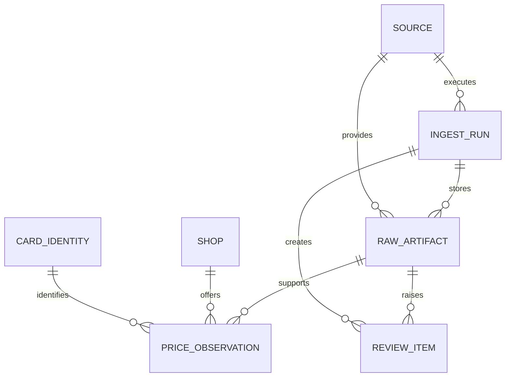

# MVPデータモデル

> 状態: Draft
>
> 最終更新: 2026-09-06
>
> 確定条件: 選定した情報源の代表サンプルで不足属性と重複規則を検証する

この文書はエンティティの意味と不変条件を定義する。具体的な列型、index、foreign keyは実装時のmigrationを正とする。

## エンティティ

| エンティティ | 役割 | 主な情報 |
| --- | --- | --- |
| `source` | 取得経路を識別する | 安定slug、種別、有効状態、設定参照 |
| `shop` | 価格を提示した主体を識別する | 表示名、正規化名、必要に応じた支店情報 |
| `ingest_run` | 一回の取込処理を追跡する | source、開始・終了日時、状態、取得・解析・保存件数、エラー分類 |
| `raw_artifact` | 解析前の証拠を追跡する | run、source内ID、URL、MIME type、content hash、取得日時、公開日時候補、保存参照 |
| `card_identity` | 同じ物理仕様のカードを内部で識別する | TCG、セット、カード番号、レアリティ、版、言語、正規化名 |
| `price_observation` | 店舗が提示した一つの確定価格を記録する | card、shop、価格、通貨、価格種別、状態条件、公開・取得日時、有効期限、artifact、parser version |
| `review_item` | 人間の判断を待つ候補を保持する | run、artifact、候補payload、理由、状態、判断日時、判断結果 |

## 関係

一つの原本から複数の価格観測を生成できる。同じ原本を異なるparser versionで再解析した場合も、以前の生成結果との関係を失わない形で履歴を表現する。

## 不変条件

### 原本

- 原本メタデータは本体保存に成功した後で確定する。
- `content_hash` は原本本体の内容から再計算できる。
- URLが存在しない手動ファイルでも、投入ファイル名、hash、取得日時、投入経路を記録する。
- 認証情報やCookieを保存本体、URL、header metadataへ残さない。

### 価格観測

- 金額は整数の最小通貨単位で、通貨と組にして保存する。
- `price_type`、shop、TCG、取得日時、artifactへの参照が必要である。
- カード同定が確定していない候補は`price_observation`に保存しない。
- 原文表記は正規化値で上書きせず、artifactまたは観測の由来情報として残す。
- 公開日時が不明な場合、取得日時を公開日時として偽装しない。
- 有効期限が明示されていない場合、推定値を`valid_until`へ保存しない。
- 以前の観測を更新・削除して訂正しない。無効化または置換関係を持つ新しい履歴で表現する。

### カード同定

- カード名だけを根拠に自動確定しない。
- TCG、セット、カード番号、レアリティ、版、言語のうち、対象TCGで必要な組合せを同定方針として別途確定する。
- 原文の別名と正規化名を保持し、正規化規則を変更しても元の入力へ戻れるようにする。
- 鑑定品、言語違い、版違いを同一カードとして集計する場合は、query側の明示的な条件とする。

### 取込実行とレビュー

- 取込実行の成功、部分失敗、失敗、正常な0件を区別する。
- review itemには人間が判断できるだけのartifact参照、候補値、理由を持たせる。
- review結果を適用しても、当初の候補と判断履歴を残す。

## 未決事項

- source内IDとcontent hashを使ったraw artifactの一意性
- 一つの価格表で同じカード・同じ価格が複数行ある場合の観測キー
- parser再解析結果の置換・派生関係
- 支店別価格とオンライン店舗価格の扱い
- 状態条件、枚数制限、会員限定、在庫上限の正規化方法
- カード同定用の外部マスタを持つかどうか

これらはPhase 0で選んだ実データを使い、Phase 2の実装前に確定する。
