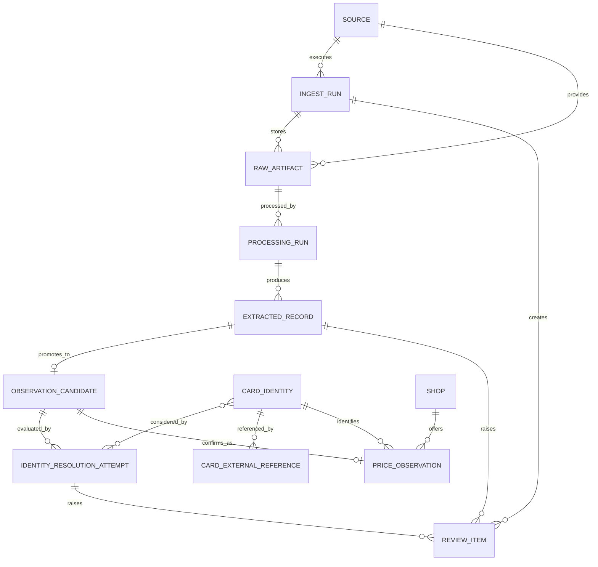

# MVPデータモデル

> 状態: Draft
>
> 最終更新: 2026-09-09
>
> 確定条件: 選定した情報源の代表サンプルで不足属性と重複規則を検証する

この文書はエンティティの意味と不変条件を定義する。具体的な列型、index、foreign keyは実装時のmigrationを正とする。

## エンティティ

| エンティティ | 役割 | 主な情報 |
| --- | --- | --- |
| `source` | 取得経路を識別する | 安定slug、種別、有効状態、設定参照 |
| `shop` | 価格を提示した主体を識別する | 表示名、正規化名、必要に応じた支店情報 |
| `ingest_run` | 一回の取込処理を追跡する | source、開始・終了日時、状態、取得・解析・保存件数、エラー分類 |
| `raw_artifact` | 解析前の証拠を追跡する | run、source内ID、URL、MIME type、content hash、取得日時、公開日時候補、保存参照 |
| `processing_run` | 保存済み原本へparser、OCR等を適用した一回の処理を追跡する | artifact、processor名・version、設定参照、開始・終了日時、状態、件数、エラー分類 |
| `extracted_record` | 原本から抽出した欠損可能な行または項目を保持する | processing run、原文値、値の由来、原本内位置、項目別confidence、警告 |
| `observation_candidate` | 価格候補として最低限の検証を通過した記録を保持する | extracted record、shop、TCG、金額、通貨、価格種別、カードの原文識別項目、日時候補 |
| `card_identity` | 価格比較で区別する同じ印刷仕様のカードを内部で識別する | 意味を持たない内部UUID、TCG、セット、カード番号、レアリティ、版、言語、正規化名 |
| `card_external_reference` | 公式マスタや情報源内のIDを内部カードへ対応付ける | namespace、外部ID、card、根拠、確認状態 |
| `identity_resolution_attempt` | 観測候補と内部カードの照合試行を追跡する | candidate、matcher名・version、候補card、根拠、match score、結果 |
| `price_observation` | 店舗が提示した一つの確定価格を記録する | candidate、card、shop、価格、通貨、価格種別、状態条件、公開・取得日時、有効期限、artifactまでの追跡 |
| `review_item` | 人間の判断を待つ抽出結果、観測候補または同定結果を保持する | run、対象record、candidateまたはresolution attempt、artifact、理由、状態、判断日時、判断結果 |

## 関係

一つの原本から複数の処理実行と抽出結果を生成できる。抽出結果が価格候補の最低条件を満たし、カード同定が確定した場合だけ価格観測へ昇格する。同じ原本を異なるprocessor versionで再解析した場合も、以前の抽出結果、同定試行、価格観測との関係を失わない形で履歴を表現する。

## 不変条件

### 原本

- 原本メタデータは本体保存に成功した後で確定する。
- `content_hash` は原本本体の内容から再計算できる。
- URLが存在しない手動ファイルでも、投入ファイル名、hash、取得日時、投入経路を記録する。
- 認証情報やCookieを保存本体、URL、header metadataへ残さない。

### 処理実行と抽出結果

- `processing_run`は一つの保存済みartifact、processor名・version、結果へ影響する設定を識別できるようにする。
- `extracted_record`はカード番号や金額等が欠けていても保存できる。欠損や値不正を、行が存在しなかったこととして扱わない。
- 抽出した原文値を正規化値で上書きしない。JSON path、CSS selector、行番号、画像内領域等、利用できる原本内位置を残す。
- 各値が原本、source metadata、取込設定、正規化処理、人間の判断のどこから得られたかを区別する。
- 取込設定からshop、TCG、通貨、価格種別等を与える場合、設定のversionまたは参照を残し、原本から直接抽出した値として扱わない。
- processorがconfidenceを返す場合は項目単位で意味と範囲を記録する。抽出confidenceをカード同定のmatch scoreとして再利用しない。
- 再処理は新しい`processing_run`と抽出結果を追加し、以前の結果を上書きしない。

### 観測候補

- `observation_candidate`は、少なくともartifactへ追跡でき、shop、TCG、金額、通貨、価格種別を検証できる抽出結果からだけ生成する。
- 金額を抽出できない、通貨を決められない等、価格候補の最低条件を満たさない結果は`extracted_record`に残し、`observation_candidate`へ昇格させない。
- カード名、カード番号、セット、レアリティ、版、言語は原文のまま保持し、カード同定前に確定値へ書き換えない。
- 同じ抽出結果と昇格規則versionから、同じ観測候補を再現できるようにする。

### 価格観測

- 金額は整数の最小通貨単位で、通貨と組にして保存する。
- `price_type`、shop、TCG、取得日時、artifactへの参照が必要である。
- カード同定が確定していない候補は`price_observation`に保存しない。
- 原文表記は正規化値で上書きせず、artifactまたは観測の由来情報として残す。
- 公開日時が不明な場合、取得日時を公開日時として偽装しない。
- 有効期限が明示されていない場合、推定値を`valid_until`へ保存しない。
- 以前の観測を更新・削除して訂正しない。無効化または置換関係を持つ新しい履歴で表現する。

### カード同定

- `card_identity_id`はCard Pulseが発行するUUIDとし、TCG、セット、カード番号、レアリティ、版、言語、情報源等の意味を埋め込まない。一度発行した値は変更せず、利用側が内部構造を解釈する前提にしない。
- カード属性を組み合わせた値、属性のhash、`source_item_id`、公式または店舗の外部IDを`card_identity`の主キーとして使わない。属性は同定と重複候補の検出に使い、外部IDはnamespaceと根拠を持つ`card_external_reference`として保存する。
- `card_external_reference`は、外部IDが一つの印刷仕様を安定して表すと確認できた場合だけ確定する。複数仕様をまとめるIDまたは安定性が不明なIDは、原本か観測候補の原文値として残す。
- カード名だけを根拠に自動確定しない。
- TCG、セット、カード番号、レアリティ、版、言語のうち、対象TCGで必要な組合せを同定方針として別途確定する。
- 原文の別名と正規化名を保持し、正規化規則を変更しても元の入力へ戻れるようにする。
- `identity_resolution_attempt`にはmatcher名・version、入力候補、検討したcard、根拠、match score、結果を残す。
- match scoreは候補間の対応の確からしさを表し、OCR等の抽出confidenceと区別する。
- 別情報源の価格観測は照合候補を作るための参考にできるが、根拠のない欠損項目を確定値として補わない。
- 鑑定品、言語違い、版違いを同一カードとして集計する場合は、query側の明示的な条件とする。
- 誤結合または重複した内部カードが判明した場合は、新しい同定試行と分割、統合、無効化または置換関係を追加し、以前の判断、価格観測、原本を上書きまたは削除しない。

### 取込実行とレビュー

- 取込実行の成功、部分失敗、失敗、正常な0件を区別する。
- 技術的な解析失敗、価格候補へ昇格できない欠損、人間が原本から修正できる抽出曖昧、カード同定の曖昧を区別する。人間の判断で解決できない処理失敗はprocessing issueに残し、review queueへ送らない。
- review itemには人間が判断できるだけのartifact参照、抽出結果、同定候補、理由を持たせる。
- review結果を適用しても、当初の候補と判断履歴を残す。

## 未決事項

- source内IDとcontent hashを使ったraw artifactの一意性
- processing run、extracted record、observation candidateの重複防止キー
- 一つの価格表で同じカード・同じ価格が複数行ある場合の観測キー
- parser再解析結果の置換・派生関係
- 項目別の値の由来とconfidenceを表す具体的なschema
- 自動同定へ昇格できるmatch scoreと根拠の条件
- UUIDのversion、生成library、分割・統合・置換関係の具体的なschema
- 支店別価格とオンライン店舗価格の扱い
- 状態条件、枚数制限、会員限定、在庫上限の正規化方法
- カード同定用の外部マスタを持つかどうか

これらはPhase 0で選んだ実データを使い、Phase 2の実装前に確定する。

この層分離を採用した理由と物理分離の再検討条件は[ADR-0007](../adr/0007-layered-ingestion-data.md)、カードの内部UUIDと外部IDを分離する理由は[ADR-0008](../adr/0008-opaque-card-identity-id.md)を参照する。
