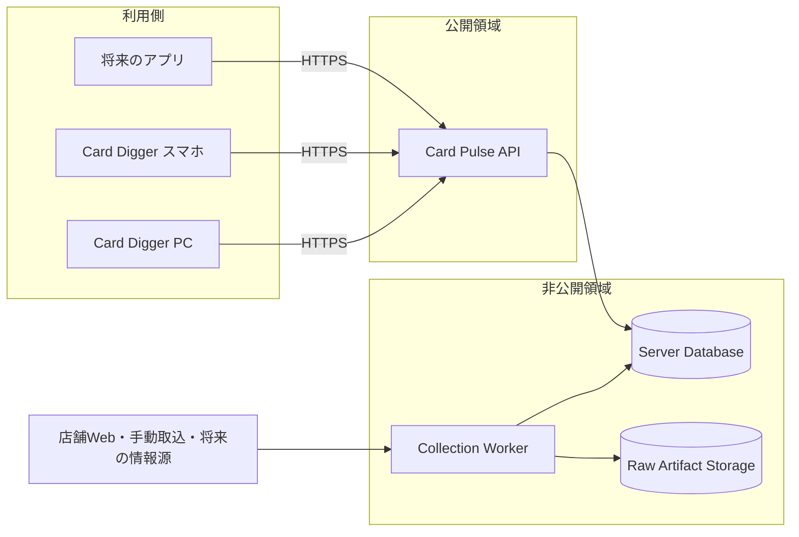
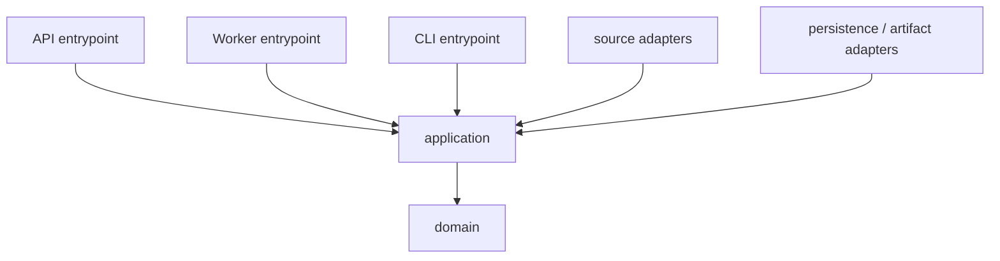
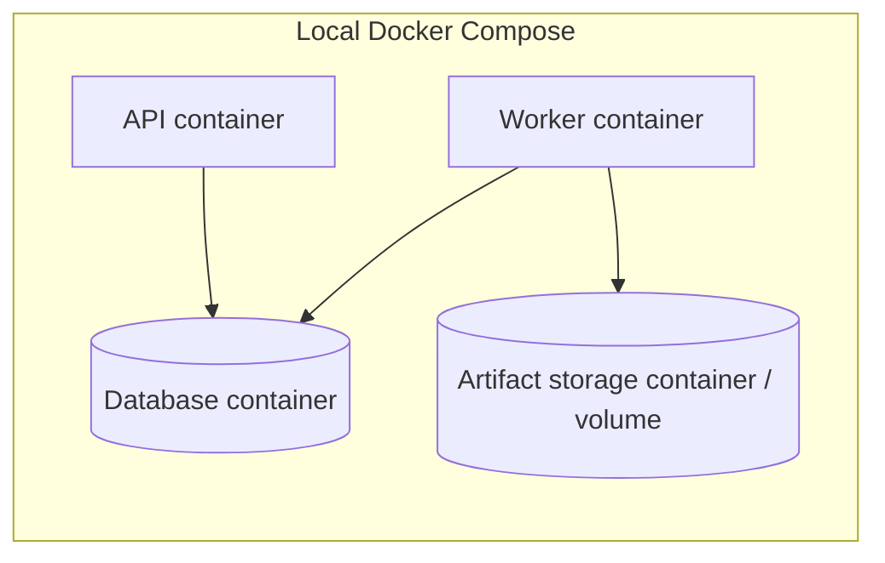

# アーキテクチャ概要

> 状態: Accepted for MVP
>
> 最終更新: 2026-09-09

## システム境界

Card Pulseは外部情報源から価格を取得し、再解析可能な原本と追跡可能な価格観測を保存し、Card Digger等へHTTPS APIで相場情報を提供する独立したシステムである。

利用側はDBへ直接接続しない。APIだけを公開し、Collection Worker、DB、artifact storageは外部公開しない。API、Worker、DBは別のruntime serviceとして扱う。

DB製品、hosting provider、台数、可用性構成は未決定である。構造化データをサーバー側DBへ置くことだけを現在の決定とし、製品は要件比較とPoC後にADRで選定する。

## コード構成

MVPは単一Pythonパッケージのモジュラーモノリスとする。APIとWorkerは同じdomain・application codeを利用しながら、異なるentrypointとして独立して起動・デプロイする。

| 領域 | 責務 | 依存してよいもの |
| --- | --- | --- |
| `domain` | 価格、同定、出典、集計に関する型と規則 | 標準ライブラリと最小限の純粋な型 |
| `application` | 取込、再解析、レビュー、照会のユースケースとport | domain |
| `adapters/sources` | HTTP、HTML、JSON、CSVなど情報源固有の取得・解析 | applicationが定義するportと候補型 |
| `adapters/persistence` | 選定したDBへの保存と検索 | applicationが定義するrepository port |
| `adapters/artifacts` | 原本の保存・読出し | applicationが定義するartifact port |
| `entrypoints/api` | HTTPS API、認証、request/response変換 | application |
| `entrypoints/worker` | 収集・解析jobとschedulerからの起動境界 | application |
| `entrypoints/cli` | 開発・運用コマンド | application |

domainとapplicationはsource adapter、特定のDB製品、object storage、Web frameworkをimportしない。entrypointが実行時に具体的なadapterを組み合わせる。

## Serviceの責務

### API

- Card Digger等から認証済みHTTPS requestを受ける。
- 最新相場、履歴、根拠観測、鮮度、欠損・曖昧状態を返す。
- DB schemaや内部tableを外部contractへ直接露出しない。
- 外部情報源への取得をrequest処理中に実行しない。

### Collection Worker

- schedulerまたは運用コマンドから取込jobを受ける。
- source adapterを実行し、解析前の原本を保存する。
- parser、検証、カード同定を実行する。
- 確定観測をDBへ保存し、曖昧な候補をreviewへ送る。
- sourceごとの障害を他のsourceとAPIへ波及させない。

### Database

- source、shop、ingest run、raw artifact metadata、processing run、extracted record、observation candidate、identity resolution attempt、card identity、card external reference、price observation、review itemを保存する。
- API、Worker、migration用に異なるroleを持たせる。
- private networkからのみ接続可能にする。
- 製品選定では整合性、transaction、query、backup・復元、運用、費用を評価する。

### Raw Artifact Storage

- HTML、JSON、CSV、PDF、画像等の原本本体を保存する。
- DBにはartifact ID、content hash、取得日時、URL、保存参照等のメタデータを持たせる。
- ローカル開発ではfilesystemまたは互換container、本番では選定したstorage serviceを使う。

## 構造化データの分離方針

情報源ごとに取得形式と不足項目が異なっても、構造化データは一つの論理的なsystem of recordで管理する。情報源ごとのDBは作らず、原本メタデータ、欠損を許す抽出結果、価格候補、同定試行、review、確定観測を処理段階で分ける。

source固有の項目と原文構造は`extracted_record`と由来情報に保持する。`price_observation`にはsourceを横断して同じ意味を持つ項目だけを入れ、確定条件を緩めない。不完全な結果を別DBへ隔離するのではなく、中間段階へ保存して再処理とreviewの対象にする。

原本本体はartifact storageに置く。情報源ごとに保持・削除条件、アクセス権、データ所在地等が異なる場合はartifact storageの物理的な配置を分けられるが、それだけを理由に共通`card_identity`や確定観測を複製しない。構造化データの物理分離は、法的条件、負荷、可用性、運用責任の差が実際に生じた時点でADRにより再判断する。

この判断の理由と代替案は[ADR-0007](../adr/0007-layered-ingestion-data.md)に記録する。

## 取込フロー

1. Workerが`ingest_run`を開始し、sourceと実行設定を確定する。
2. source adapterが低頻度・制限付きで原本を取得する。
3. 解析前に原本本体をartifact storageへ保存する。
4. DBへ原本メタデータと処理状態を記録する。
5. parserまたは将来のOCR等について`processing_run`を開始し、processor名・versionと設定を確定する。
6. processorが保存済み原本から、欠損、原文値、原本内位置、利用できる項目別confidenceを含む`extracted_record`を生成する。
7. applicationがshop、TCG、金額、通貨、価格種別等を検証し、最低条件を満たす抽出結果だけを`observation_candidate`へ昇格させる。
8. 最低条件を満たさない抽出結果はprocessing issueとして残し、確定観測へ混ぜない。
9. 観測候補に対してカード同定を実行し、matcher version、候補card、根拠、match score、結果を`identity_resolution_attempt`へ記録する。
10. 確定可能な候補だけをDB transactionで`price_observation`として保存し、人間が解決できる曖昧な結果を理由付きで`review_item`へ送る。
11. 各段階の件数とエラー分類を記録し、`processing_run`と`ingest_run`を完了または失敗にする。

DBとartifact storageを一つのtransactionで更新できる前提にしない。片方だけが成功した状態を記録し、idempotency keyによる再実行と孤立データの検出で回復する。processing、候補への昇格、同定、review確定を同じtransactionに含めるかも含め、具体的なtransaction boundaryと状態遷移はPhase 2で決定する。

## ローカル開発

Docker Composeで、API、Worker、選定DB、artifact storageのservice topologyを一台の開発PC上に再現する。

Dockerでapplication runtime、依存version、network、volume、環境変数の形をそろえる。本番のmanaged service、IAM、load balancer、実network latency、backup、自動拡張、障害復旧まで再現できるとは扱わない。詳しくは [Dockerによる環境再現](../learning/docker-environment-reproduction.md) を参照する。

## 障害と変更の分離

- sourceごとに取込実行、設定、再試行、エラーを分ける。
- APIとWorkerを別serviceにし、収集処理の停止や高負荷からAPIを分離する。
- 0件と取得失敗を別の結果として扱う。
- parserの件数急減や必須項目欠損を検知し、壊れたデータを正常値として確定しない。欠損した抽出結果は中間段階に隔離し、再処理可能にする。
- source停止中も保存済みデータのAPI照会を可能にする。
- X、OCR等の不安定または重い依存は、採用時も専用adapterへ閉じ込める。

serviceを分けても、DB schemaとAPI・Workerの依存は残る。影響を抑えるため、後方互換なmigration、deployment順序、role別権限、rollback、backup・restoreを実装前のTODOとして扱う。

## 変更の管理

複数領域へ影響する方針変更、DB製品、永続化方式、同定規則、外部contractはADRに残す。列レベルのDB変更はmigration、外部データ形式はversion付きschema、Python内部の境界は型定義を正とする。

## 関連文書

- [ADR-0001: モジュラーモノリス](../adr/0001-modular-monolith.md)
- [ADR-0002: 追記型と出典追跡](../adr/0002-append-only-provenance.md)
- [ADR-0004: サーバー側DBと製品選定](../adr/0004-server-database-selection.md)
- [ADR-0005: runtime serviceの分離](../adr/0005-separate-runtime-services.md)
- [ADR-0006: Dockerによるローカル開発](../adr/0006-docker-compose-local-development.md)
- [ADR-0007: 処理段階による構造化データの分離](../adr/0007-layered-ingestion-data.md)
- [ADR-0008: カード同定の内部UUID](../adr/0008-opaque-card-identity-id.md)
- [データモデル](data-model.md)
- [Collector契約](../contracts/collector.md)
