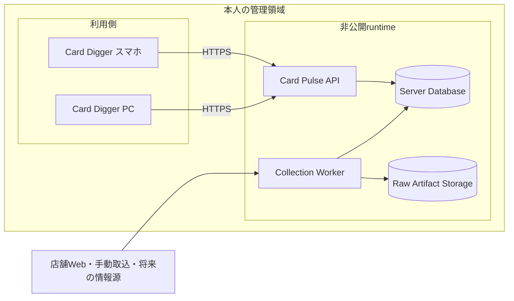
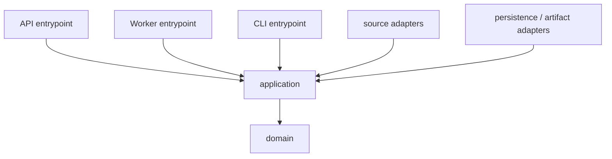
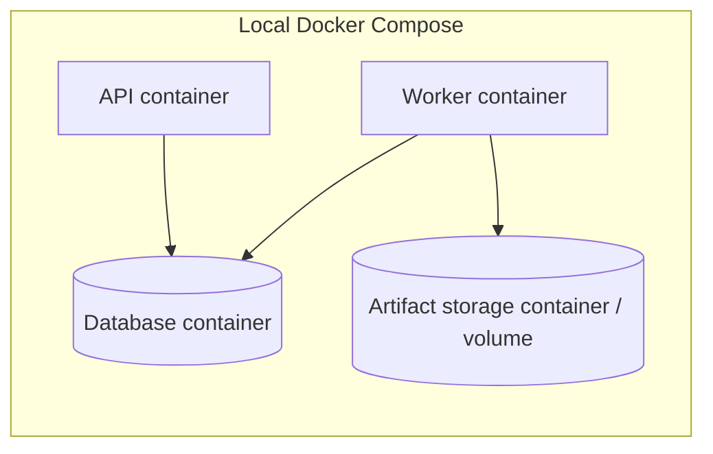

# アーキテクチャ概要

> 状態: Accepted for MVP
>
> 最終更新: 2026-09-12

## システム境界

Card Pulseは外部情報源から価格を取得し、再解析可能な原本と追跡可能な価格観測を保存し、プロジェクトオーナー本人のCard Digger等へ非公開APIで相場情報を提供する独立したシステムである。すべてのruntimeと保存データを本人の端末またはprivate network内に置き、Internetへ公開しない。

利用側はDBへ直接接続しない。APIも外部公開せず、既定でloopbackまたはCompose内部networkだけにbindする。本人の端末間で利用する場合だけprivate networkと認証を使う。API、Worker、DBは別のruntime serviceとして扱う。

DB製品、本人の端末内またはprivate network内の配置、台数、可用性構成は未決定である。構造化データをサーバー型DBへ置くことだけを現在の決定とし、製品は要件比較とPoC後にADRで選定する。

## コード構成

MVPは単一Pythonパッケージのモジュラーモノリスとする。APIとWorkerは同じdomain・application codeを利用しながら、異なるentrypointとして独立して起動・デプロイする。

| 領域 | 責務 | 依存してよいもの |
| --- | --- | --- |
| `domain` | 価格、同定、出典、集計に関する型と規則 | 標準ライブラリと最小限の純粋な型 |
| `application` | 取込、再解析、レビュー、照会のユースケースとport | domain |
| `adapters/sources` | HTTP、HTML、JSON、CSVなど情報源固有の取得・解析 | applicationが定義するportと候補型 |
| `adapters/persistence` | 選定したDBへの保存と検索 | applicationが定義するrepository port |
| `adapters/artifacts` | 原本の保存・読出し | applicationが定義するartifact port |
| `entrypoints/api` | HTTPS API、認証、request/response変換 | application |
| `entrypoints/worker` | 収集・解析jobとschedulerからの起動境界 | application |
| `entrypoints/cli` | 開発・運用コマンド | application |

domainとapplicationはsource adapter、特定のDB製品、object storage、Web frameworkをimportしない。entrypointのcomposition rootが実行時に具体的なadapterを組み合わせる。

## 情報源adapterの境界

Collection Workerは取込を実行するruntime serviceであり、情報源固有コードの境界ではない。外部情報源の仕様変更を受け止める単位は、`src/card_pulse/adapters/sources/<source-slug>/`に置くsource adapterとする。一つのsource adapterは一つの安定したsource slugを担当し、別sourceのadapterをimportしない。

情報源固有の変更を閉じ込める論理境界には、production codeであるsource packageに加え、そのsourceの設定、fixture、testを含める。実行時の設定値を`config/`、fixtureを`tests/fixtures/sources/`へ置く場合も、source slugによって所有者を明確にする。情報源の通常の形式変更では、この境界内だけを変更して復旧できる構成を維持する。

| 境界内に置くもの | 境界外に置くもの |
| --- | --- |
| URLとrequestの組立て、source固有のheader・Cookie・取得上限の解釈 | scheduler、取込runの開始・完了、sourceの運用状態 |
| redirect、media type、応答内の目印、schema・DOM・列数等の検査 | artifact storageとDBへの保存、transaction、冪等性 |
| 保存済み原本を読むparser、原文項目の抽出、source内IDの解釈 | 観測候補への共通昇格、source横断のカード同定・重複排除 |
| source固有のerror分類材料、設定、fixture、parser regression test | 価格観測のdomain規則、相場集計、API、Card Digger向け評価 |

source adapterとapplicationの境界は、applicationが定義する取得port、処理port、共通の入出力型、構造化された失敗型である。source adapterは、HTTP clientのresponse object、HTMLのDOM object、CSS selector、source固有のJSON model、source固有例外を境界外へ返さない。原文構造を失わず保存する必要がある値は、共通`RawArtifactInput`のmetadataまたは`ExtractedRecord`の原文値・由来情報として渡す。applicationはそれらを保存・伝達できるが、source slugによる条件分岐で意味を解釈しない。

具体的なsource adapterを選択する責務はentrypointのcomposition rootに置く。source slugとadapterの対応表以外に、`if source_slug == ...`のような分岐をapplication、domain、永続化、APIへ置かない。source adapterはapplicationが定義するportへ依存できるが、applicationとdomainからsource packageへ依存しない。source adapterからDB、artifact storage、APIを直接呼び出さない。

複数sourceで共有するHTTP transportは、各source packageの外側にsource-neutralなadapter moduleとして置き、request送信、timeout、response受信、設定されたbackoffの実行等、情報源の意味を知らない機構に限定する。source adapterはこのtransportへsource設定を渡し、一回のfetch内で許されるrequest単位の再試行を委譲する。共有処理へsource固有のURL、selector、JSON key、価格条件、source slugによる分岐を入れない。共通化するには二つ以上のadapterで同じ意味と変更理由を持つことを確認し、単にコード形状が似ているだけの処理は各source境界に残す。

source adapterは外部形式を共通契約へ変換するが、新しい情報源に共通domainで意味を持つ価格種別や状態条件が現れた場合、その情報をadapter内で捨てない。共通契約で損失なく表現できない事実は原文値と由来を保持してreviewへ送り、Collector契約またはdomain modelの変更として判断する。この場合の変更は境界漏れではなく、Card Pulseが扱う共通の意味の変更として記録する。

実行時は一つのsourceに一つの`ingest_run`と例外境界を設け、通常の通信・解析・データ品質の失敗を他sourceのrunへ波及させない。このコード境界は、同じWorker process全体の停止、メモリ枯渇、CPU占有まで物理的に隔離するものではない。実測によりprocess単位の隔離が必要になった場合は、sourceごとのWorker分離を新しいADRで判断する。

## Serviceの責務

### API

- 本人が管理するCard Digger等から、loopback、Compose内部network、または認証済みprivate network経由のrequestを受ける。
- 最新相場、履歴、根拠観測、鮮度、欠損・曖昧状態を返す。
- DB schemaや内部tableを外部contractへ直接露出しない。
- 外部情報源への取得をrequest処理中に実行しない。

### Collection Worker

- schedulerまたは運用コマンドから取込jobを受ける。
- source adapterを実行し、解析前の原本を保存する。
- parser、検証、カード同定を実行する。
- 確定観測をDBへ保存し、曖昧な候補をreviewへ送る。
- sourceごとの障害を他のsourceとAPIへ波及させない。

### Database

- source、shop、ingest run、raw artifact metadata、processing run、extracted record、observation candidate、identity resolution attempt、card identity、card external reference、price observation、review itemを保存する。
- API、Worker、migration用に異なるroleを持たせる。
- Compose内部networkまたは本人のprivate networkからのみ接続可能にする。
- 製品選定では整合性、transaction、query、backup・復元、運用、費用を評価する。

### Raw Artifact Storage

- HTML、JSON、CSV、PDF、画像等の原本本体を保存する。
- DBにはartifact ID、content hash、取得日時、URL、保存参照等のメタデータを持たせる。
- 本人が管理するfilesystem、volume、またはprivate storage serviceを使う。
- source由来の原本、fixture、抽出値、価格履歴をGit、CI artifact、公開backupへ含めない。

## 構造化データの分離方針

情報源ごとに取得形式と不足項目が異なっても、構造化データは一つの論理的なsystem of recordで管理する。情報源ごとのDBは作らず、原本メタデータ、欠損を許す抽出結果、価格候補、同定試行、review、確定観測を処理段階で分ける。

source固有の項目と原文構造は`extracted_record`と由来情報に保持する。`price_observation`にはsourceを横断して同じ意味を持つ項目だけを入れ、確定条件を緩めない。不完全な結果を別DBへ隔離するのではなく、中間段階へ保存して再処理とreviewの対象にする。

原本本体はartifact storageに置く。情報源ごとに保持・削除条件、アクセス権、データ所在地等が異なる場合はartifact storageの物理的な配置を分けられるが、それだけを理由に共通`card_identity`や確定観測を複製しない。構造化データの物理分離は、法的条件、負荷、可用性、運用責任の差が実際に生じた時点でADRにより再判断する。

この判断の理由と代替案は[ADR-0007](../adr/0007-layered-ingestion-data.md)に記録する。

## 取込フロー

1. Workerが`ingest_run`を開始し、sourceと実行設定を確定する。
2. source adapterが低頻度・制限付きで原本を取得する。
3. 解析前に原本本体をartifact storageへ保存する。
4. DBへ原本メタデータと処理状態を記録する。
5. parserまたは将来のOCR等について`processing_run`を開始し、processor名・versionと設定を確定する。
6. processorが保存済み原本から、欠損、原文値、原本内位置、利用できる項目別confidenceを含む`extracted_record`を生成する。
7. applicationがshop、TCG、金額、通貨、価格種別等を検証し、最低条件を満たす抽出結果だけを`observation_candidate`へ昇格させる。
8. 最低条件を満たさない抽出結果はprocessing issueとして残し、確定観測へ混ぜない。
9. 観測候補に対してカード同定を実行し、matcher version、候補card、根拠、match score、結果を`identity_resolution_attempt`へ記録する。
10. 確定可能な候補だけをDB transactionで`price_observation`として保存し、人間が解決できる曖昧な結果を理由付きで`review_item`へ送る。
11. 各段階の件数とエラー分類を記録し、`processing_run`と`ingest_run`を完了または失敗にする。

DBとartifact storageを一つのtransactionで更新できる前提にしない。片方だけが成功した状態を記録し、idempotency keyによる再実行と孤立データの検出で回復する。processing、候補への昇格、同定、review確定を同じtransactionに含めるかも含め、具体的なtransaction boundaryと状態遷移はPhase 2で決定する。

## ローカル開発

Docker Composeで、API、Worker、選定DB、artifact storageのservice topologyを一台の開発PC上に再現する。

Dockerでapplication runtime、依存version、network、volume、環境変数の形をそろえる。本人の端末外に公開する構成はMVPで扱わない。host間のprivate network、認証、実network latency、backup、障害復旧は必要になった時点で別に検証する。詳しくは [Dockerによる環境再現](../learning/docker-environment-reproduction.md) を参照する。

## 障害と変更の分離

- sourceごとに取込実行、設定、再試行、エラーを分ける。
- APIとWorkerを別serviceにし、収集処理の停止や高負荷からAPIを分離する。
- 0件と取得失敗を別の結果として扱う。
- HTTP成功だけで取込成功とせず、実行開始、通信、応答、構造、データ品質、保存の各段階を分けて記録する。
- parserの件数急減や必須項目欠損を検知し、壊れたデータを正常値として確定しない。欠損した抽出結果は中間段階に隔離し、再処理可能にする。
- sourceの停止理由、直近の試行、最終成功日時を追跡し、異常な実行で観測の鮮度を更新しない。
- source停止中も保存済みデータのAPI照会と他sourceの取込を可能にする。
- 復旧時は保存済み原本でparser修正を検証し、新しいprocessor versionで追記型の再解析を行ってから手動で定期取得へ戻す。
- X、OCR等の不安定または重い依存は、採用時も専用adapterへ閉じ込める。

失敗段階、診断証拠、停止・再開条件の詳細は[Collector契約](../contracts/collector.md#結果と失敗)に定め、実行手順は定期取得の開始前に`source-failure` Runbookへ記載する。serviceを分けても、DB schemaとAPI・Workerの依存は残る。影響を抑えるため、後方互換なmigration、deployment順序、role別権限、rollback、backup・restoreを実装前のTODOとして扱う。

## 変更の管理

複数領域へ影響する方針変更、DB製品、永続化方式、同定規則、外部contractはADRに残す。列レベルのDB変更はmigration、外部データ形式はversion付きschema、Python内部の境界は型定義を正とする。

## 関連文書

- [ADR-0001: モジュラーモノリス](../adr/0001-modular-monolith.md)
- [ADR-0002: 追記型と出典追跡](../adr/0002-append-only-provenance.md)
- [ADR-0004: サーバー側DBと製品選定](../adr/0004-server-database-selection.md)
- [ADR-0005: runtime serviceの分離](../adr/0005-separate-runtime-services.md)
- [ADR-0006: Dockerによるローカル開発](../adr/0006-docker-compose-local-development.md)
- [ADR-0007: 処理段階による構造化データの分離](../adr/0007-layered-ingestion-data.md)
- [ADR-0008: カード同定の内部UUID](../adr/0008-opaque-card-identity-id.md)
- [ADR-0012: 個人用の非公開運用](../adr/0012-private-personal-operation.md)
- [データモデル](data-model.md)
- [Collector契約](../contracts/collector.md)
