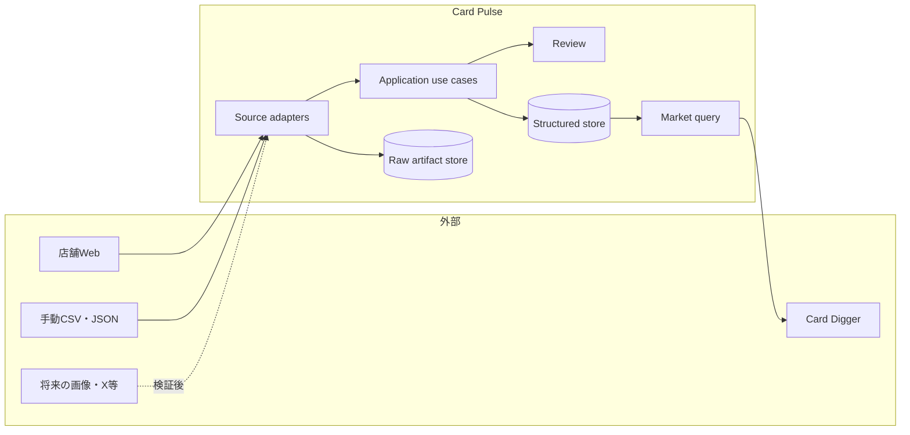
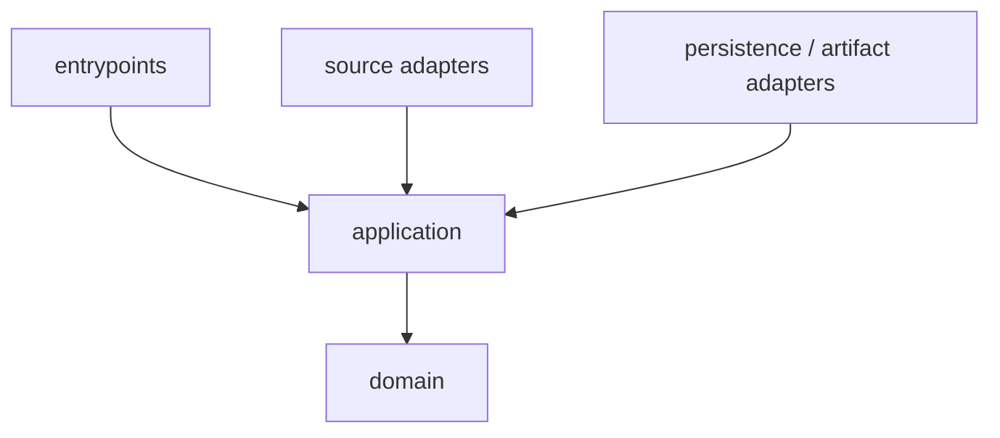

# アーキテクチャ概要

> 状態: Accepted for MVP
>
> 最終更新: 2026-09-06

## システム境界

Card Pulseは外部情報源から価格を取得し、再解析可能な原本と追跡可能な価格観測を保存し、利用側へ相場情報を返す独立したシステムである。

取得元、DB、原本保存先、CLIは交換可能な外部詳細として扱い、価格観測とカード同定の規則から分離する。

## 構成方針

MVPは単一Pythonパッケージのモジュラーモノリスとする。プロセスやdeploymentを早期に分けず、コード上の依存方向で責務を分ける。

| 領域 | 責務 | 依存してよいもの |
| --- | --- | --- |
| `domain` | 価格、同定、出典、集計に関する型と規則 | 標準ライブラリと最小限の純粋な型 |
| `application` | 取込、再解析、レビュー、照会のユースケースとport | domain |
| `adapters/sources` | HTTP、HTML、JSON、CSVなど情報源固有の取得・解析 | applicationが定義するportと候補型 |
| `adapters/persistence` | SQLiteなどへの保存と検索 | applicationが定義するrepository port |
| `adapters/artifacts` | 原本ファイルの保存・読出し | applicationが定義するartifact port |
| `entrypoints` | CLI、scheduler、将来のAPI | application |

domainとapplicationはsource adapter、SQLite、ファイルシステムをimportしない。実行時にentrypointが具体的なadapterを組み合わせる。

## 取込フロー

1. `ingest_run` を開始し、sourceと実行設定を確定する。
2. source adapterが低頻度・制限付きで原本を取得する。
3. 解析前に原本本体とメタデータをartifact storeへ保存する。
4. parserが保存済み原本から観測候補を生成する。
5. applicationが必須項目、金額、日時、重複を検証する。
6. カード同定を行い、確定可能な候補だけを価格観測として保存する。
7. 曖昧、欠損、異常な候補を理由付きでreview itemへ送る。
8. 件数とエラー分類を記録し、`ingest_run` を完了または失敗にする。

途中で失敗した場合も、確定前の候補を部分的な観測値として扱わない。保存済み原本がある場合は、外部へ再アクセスせず再解析できるようにする。

## 保存境界

- SQLiteはsource、shop、ingest run、raw artifact metadata、card identity、price observation、review itemを保存する第一候補とする。
- 原本本体はファイルシステムへ保存し、SQLiteから安定した相対パスまたはartifact IDで参照する。
- applicationはSQLiteのテーブルやファイルパスを直接扱わず、repositoryとartifact storeのportを使う。
- PostgreSQLやobject storageへの移行は、ローカルMVPで必要性が確認された後に判断する。

## 障害の分離

- sourceごとに取込実行、設定、再試行、エラーを分ける。
- 0件と取得失敗を別の結果として扱う。
- parserの件数急減や必須項目欠損を検知し、壊れたデータを正常値として確定しない。
- source停止中も保存済みデータの照会を可能にする。
- X、OCR等の不安定または重い依存は、採用時も専用adapterへ閉じ込める。

## 変更の管理

複数領域へ影響する方針変更、永続化方式、同定規則、外部契約はADRに残す。列レベルのDB変更はmigration、外部データ形式はversion付きschema、Python内部の境界は型定義を正とする。

## 関連文書

- [ADR-0001: モジュラーモノリス](../adr/0001-modular-monolith.md)
- [ADR-0002: 追記型と出典追跡](../adr/0002-append-only-provenance.md)
- [データモデル](data-model.md)
- [Collector契約](../contracts/collector.md)
