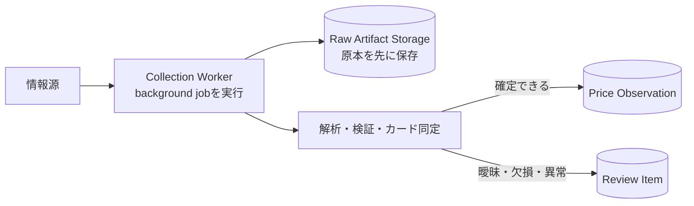

# DB選定の判断軸

> 対象: Card Pulseの構造化データを保存する主DB
>
> 最終更新: 2026-09-07

## 1. DB選定の基本的な考え方

DBは、知名度や一般的な性能比較だけでは選ばない。アプリケーションが守るべきデータ、実行するquery、障害時に失ってよい範囲、運用できる人と費用から選ぶ。

基本的な順序は次のとおりである。

```text
アプリケーション要件
    ↓
必須条件と比較項目
    ↓
候補の絞り込み
    ↓
代表的な処理によるPoC
    ↓
運用・費用を含めた評価
    ↓
ADRで採用理由と再評価条件を記録
```

Card Pulseの主DBは一時的なcacheではない。カード、店舗、取得原本のメタデータ、価格観測、同定結果、review履歴を持つsystem of recordである。このため、最大処理件数だけでなく、間違った価格や誤ったカード結合を防ぎ、根拠をたどれることを重視する。

HTML、JSON、PDF、画像等の原本本体は別のartifact storageへ保存する。大きなbinaryの保存要件を主DBの比較へ混ぜない。

## 2. 用語と処理の全体像

### 2.1 データと取込に関する用語

| 用語 | 意味 | Card Pulseでの例 |
| --- | --- | --- |
| entity（エンティティ） | システムで区別して扱う「もの」や「出来事」の種類。設計上の概念を指し、DBでは多くの場合tableとして表す | `shop`、`raw_artifact`、`price_observation`、`review_item`がentityに当たる。一件ごとの店舗や観測はentityの実体である |
| relation（関係） | entity同士がどのようにつながるかを表すもの | 一つの`raw_artifact`から複数の`price_observation`が生成される関係、各観測が一つの`shop`を参照する関係がある。この文書ではrelationをこの意味で使う。関係データベース理論ではtable自体をrelationと呼ぶ場合もある |
| 参照整合性 | あるデータが参照する相手が必ず存在し、関係が壊れていない性質。relational databaseでは主にforeign keyで強制する | 存在しない`shop`や`raw_artifact`のIDを持つ価格観測を保存させない |
| 観測数 | 保存または処理する`price_observation`の件数 | 一つの価格表に100枚のカードがあれば、一つの原本から100件の観測が生じ得る |
| 原本数 | 取得して保存するHTML、JSON、CSV、PDF、画像等の`raw_artifact`の件数 | 一日に取得するWebページや手動投入ファイルの数。原本本体はartifact storageへ、その参照情報は主DBへ保存する |
| review数 | 人間の判断が必要な`review_item`の件数 | カード番号がなく同名カードを区別できない候補が10件あれば、review数は10件になる |
| source固有の可変metadata | 特定の情報源だけが持ち、項目の追加や形式変更が起こりやすい補助情報 | キャンペーン名、ページ番号、情報源独自のカテゴリなど。金額、通貨、店舗、TCG、取得日時のような全source共通の必須項目とは分ける |
| 訂正 | 過去の記録を消さず、誤りを示す履歴と正しい記録を追加すること | 誤って別カードへ結び付けた観測を無効とし、正しいカードを参照する新しい観測を追加する |
| 再解析 | 保存済み原本を、同じ、または新しいparser versionで再び解析すること | parserの不具合修正後に、外部サイトへ再アクセスせず保存済みHTMLから候補を作り直す |
| 失効 | 記録を物理削除せず、ある時点から有効な判断材料ではないと示すこと | 情報源側の撤回や解析誤りが判明した観測に、失効理由と対象を示す新しい履歴を関連付ける |
| 鮮度 | その価格を現在の判断に使える新しさ。単なる「取得からの経過時間」だけでなく、公開日時、取得日時、有効期限、情報源の更新特性から判定する | 取得から24時間以内でも、明示された有効期限を過ぎた価格は新鮮とは扱わない |
| review item | カード同定が曖昧、必須値が欠損、値が異常などの理由で、自動確定せず人間の判断を待つ記録 | 候補値、review理由、原本内の位置、原本参照を保持し、確定した価格観測へ混ぜない |

主要なentityと正確な関係は [MVPデータモデル](../architecture/data-model.md)、Card Pulse固有の用語は [用語集](../domain/glossary.md) を正とする。

### 2.2 Collection Workerとsnapshot

workerとは、利用者からのHTTP requestへその場で応答する処理とは別に、jobを受けてバックグラウンド処理を進めるプログラムまたは実行単位である。Collection Workerは単なる「DB書込みプログラム」ではない。情報源からの取得、原本保存、解析、検証、カード同定、確定観測またはreview itemのDB保存までを調整する。情報源固有のadapterはDBへ直接書き込まず、Workerから呼ばれるapplication処理が保存順序とtransactionを管理する。



snapshotは「ある時点の状態を切り取ったもの」という意味である。この文書の読取り要件でいうsnapshotは、API結果の基準時刻を指す。例えば10時時点の相場を返すなら、11時に新しい観測が入っても「10時時点」という条件の結果には混ぜない。

DBの資料では、同じ単語がtransaction中に見えるデータの範囲や、backup用に保存したDB全体の状態を指す場合もある。混同を避けるため、以降ではAPI結果には「基準時刻（as of）」、backupには「DB snapshot」と用途を添える。

### 2.3 transactionと同時実行に関する用語

transactionは、複数のDB操作を一つの処理単位として扱う仕組みである。途中で失敗したときは`rollback`ですべて取り消し、成功したときだけ`commit`で確定する。例えばreview確定時に「判断履歴を記録する」と「価格観測を追加する」を一つのtransactionにすれば、片方だけが残る状態を防げる。

ACIDは、transactionに期待する次の四つの性質の頭文字である。

| 性質 | 意味 | Card Pulseで防ぎたい例 |
| --- | --- | --- |
| Atomicity（原子性） | 一連の操作が全部成功するか、全部取り消される | 観測は追加されたが、根拠となる処理記録は追加されていない |
| Consistency（一貫性） | transactionの前後で、定義したconstraintや不変条件を満たす | 存在しない店舗を参照する観測や、必須の通貨がない観測が残る |
| Isolation（分離性） | 同時実行中の未確定な途中状態が、別のtransactionへ不適切に影響しない | 二つのWorkerが互いの途中結果を見て、同じ観測を二重に確定する |
| Durability（永続性） | commit済みの結果が、DB processの異常終了後も保持される | DBが成功を返した観測が、直後の再起動で消える |

ACID transactionとは、これらの性質を提供するtransactionを指す。ただし、DBがACID対応であっても、どの操作を一つのtransactionへ含めるか、どのconstraintを定義するかはapplication側の設計が必要である。また、DBとartifact storageを一つのtransactionでまとめられるとは限らない。

| 用語 | 意味と扱い |
| --- | --- |
| isolation level | 同時transactionからどの変更が見えるかを定める強さ。一般に強くすると同時実行による矛盾を防ぎやすいが、待機や再試行が増え得る。`Read Committed`、`Repeatable Read`、`Serializable`等があり、同じ名前でも細部はDB製品ごとに確認する |
| unique constraint | 指定した一列、または複数列の組合せを重複させないDB制約。同じ原本・parser・観測位置等から作る重複防止keyを一意にすれば、複数Workerが同時に保存してもDBが最後の防衛線になる。正確なkeyは実データ確認後に決める |
| lock | 更新中の行やtable等を、競合する別処理が同時に変更しないための仕組み |
| lock待ち | 必要なlockを別transactionが保持しているため、その終了まで処理が待つ状態。短時間なら正常だが、長いtransactionや不適切なindexにより長引くとAPI遅延につながる |
| deadlock | transaction AがBのlockを待ち、BもAのlockを待つように、互いが進めなくなる状態。DBは通常どちらかを中止するため、applicationはtransaction全体を安全に再試行できるようにする |
| serialization failure | `Serializable`等で同時実行した結果を「何らかの順番で一件ずつ実行した結果」と同じにできないとDBが判断し、transactionを中止すること。障害というより整合性を守るための正常な拒否なので、最新状態からtransaction全体を再試行する |

### 2.4 API、接続、権限に関する用語

| 用語 | 意味 | Card Pulseでの例 |
| --- | --- | --- |
| API instance | Card Pulse APIが実際に動いている一つのprocessまたはcontainer。負荷分散のため同じAPIを二つ起動すれば2 instanceになる | 全instanceのconnection pool合計がDBの接続上限を超えないようにする |
| connection | APIやWorkerとDBの間に確立する通信セッション。確立や認証には費用がかかり、DB側にも同時接続上限がある | 一つのAPI requestが処理中だけconnectionを借りる |
| connection pool | あらかじめ作った少数のDB connectionを再利用する仕組み。処理はpoolから借り、完了後に返す | requestごとの接続作成を減らせるが、API instanceを増やすとpool数も合算される |
| private network | internetからDBへ直接到達できず、許可したAPI、Worker、運用経路だけが接続できるnetwork境界 | DBのpublic accessを無効にし、service間の許可規則を設定する。privateでもTLSと認証は必要である |
| role | DB内の権限をまとめた主体。製品によってuserとgroupを兼ねる | APIには必要な読取り、Workerには取込に必要な書込み、migrationにはschema変更権限だけを与える |
| credential | 接続時にrole本人であることを証明する秘密情報や証明書 | password、短期token、client certificate等。設定ファイルやGitへ保存せず、更新できる方法を用意する |
| audit log | 誰が、いつ接続し、どの管理操作やデータ操作を行ったかを後から確認する記録 | migration roleによるschema変更や認証失敗を追跡する。価格観測の出典履歴とは目的が異なる |
| schema migration tool | table、column、constraint、index等の変更をversion付き手順として順番に適用する道具 | 空DBから同じschemaを再現し、どの変更まで適用済みかを管理する。採用製品とPython構成に合うtoolはDB選定後に決める |

### 2.5 backupと可用性に関する用語

| 用語 | 意味 | 注意点 |
| --- | --- | --- |
| replica | primary DBのデータを複製した別のDB実体 | 読取り負荷の分散やfailover先に使える。反映が遅れる構成では最新データがまだ見えないことがある |
| replication | primaryからreplicaへ変更を継続的に転送・反映する仕組み | 可用性や読取り分散に役立つが、誤削除も複製され得るためbackupの代わりにはならない |
| failover | primaryが利用不能になったとき、replicaまたはstandbyを新しいprimaryへ切り替えること | 自動か手動か、切替判定、接続先変更、データ未反映分、復旧後の戻し方まで確認する |
| RPO | Recovery Point Objective。障害時に失ってよいデータを時間で表した上限 | RPOが1時間なら、最大1時間分の更新を失う復旧点を許容する。backup間隔だけでなく、backup成功確認とreplicationの遅れも関係する |
| RTO | Recovery Time Objective。停止してからserviceを復旧させるまでの許容時間 | RTOが4時間なら、検知、判断、DB復元、API接続確認までを4時間以内に終える必要がある |

RPOとRTOは製品が自動的に決める値ではなく、事業側が先に決める目標である。短くするほど、頻繁なbackup、replication、自動failover、復旧訓練等の費用と運用負荷が増えやすい。

## 3. 最初に整理する要件

候補製品を見る前に、分からないものを含めて次を記録する。不明な値は推測で確定せず、「初期想定」「計測後に更新」と区別する。

Card Pulseの現在の初期基準とPoC合格条件は[DB要件](../architecture/database-requirements.md)を正とする。このsectionは、要件を作成または再評価するときの確認項目として使う。

### データ

- 主要entityとrelationは何か。
- 一意性や参照整合性をDBでどこまで強制するか。
- 価格観測を何年間保持するか。
- 一日あたりの観測数、原本数、review数はどれくらいか。
- source固有の可変metadataをどの程度持つか。
- 訂正、再解析、失効をどのような履歴で表現するか。

### 書込み

- Collection Workerは何台あり、同時に何件書き込むか。
- 一つの原本から何件の観測値が生成されるか。
- 同一原本を再実行したとき、どのkeyで重複を防ぐか。
- 途中失敗時に、どの単位までまとめてrollbackするか。
- reviewの同時更新をどう検知するか。

### 読取り

- カードごとの最新価格をどう取得するか。
- 期間別履歴、店舗比較、中央値、店舗数をどの頻度で計算するか。
- Card Diggerから一回の操作で何カード照会するか。
- 許容するAPI応答時間はどれくらいか。
- 古い価格や欠損を、どの基準時刻（as of）のsnapshotとして返すか。

### 運用

- 許容停止時間はどれくらいか。
- 障害時に失ってよいデータ時間、つまりRPOはどれくらいか。
- 何時間以内に復旧したいか、つまりRTOはどれくらいか。
- backupを誰が取得し、誰が復元を確認するか。
- 夜間・休日の障害対応をどこまで行うか。
- 月額費用と人間の運用時間をどこまで許容するか。

## 4. 主な判断軸

### 4.1 データモデルへの適合

Card Pulseには、カード、店舗、原本、観測値、reviewという関係がある。DBがrelation、unique constraint、foreign key、check constraintを自然に表現できるか確認する。

「柔軟なschema」は常に利点ではない。source固有metadataには柔軟性が役立つが、金額、通貨、店舗、TCG、取得日時などの必須値まで自由にすると、不完全なデータを確定しやすくなる。固定すべきcore fieldと可変metadataを分けて評価する。

### 4.2 整合性とtransaction

次を確認する。

- ACID transactionを必要な単位で利用できるか。
- isolation levelを選び、同時実行時の挙動を説明できるか。
- unique constraintによる冪等性を実現できるか。
- constraint違反をapplicationから判別できるか。
- deadlockやserialization failureを検知して安全に再試行できるか。

Card Pulseでは、誤った重複排除やカード同定の混入は後から判断を壊すため、整合性を最優先にする。

### 4.3 Queryへの適合

一般的なbenchmarkではなく、実際に必要なqueryで比較する。

- カード・店舗ごとの最新観測
- 指定期間の価格履歴
- 同じ条件にそろえた中央値、最高値、最低値
- 観測のある店舗数
- source、鮮度、状態条件による絞り込み
- 集計値から原本までの追跡
- 未処理review itemの取得

index、window function、aggregation、JSON field、partitioning等が、実際のqueryとデータ量に対して使いやすいかを見る。

#### DBによって実行できないqueryはあるか

ある。同じ「データを検索する」という目的でも、DBの種類や製品によってquery language、構文、関数、型、index、transactionの機能が異なる。ある製品で使えるqueryを別製品へそのまま渡すと、構文エラーになる場合も、同じ結果を返せない場合もある。

例えばrelational databaseではtable間を`JOIN`して集計する形が自然だが、document databaseでは関連データを一つのdocumentへ埋め込むか、製品固有のaggregation機能で結合する。中央値も、直接使える集計関数、percentile関数の組合せ、application側での計算など実現方法が異なる。JSON内の検索、window function、再帰query、全文検索、時系列処理も対応範囲と構文が同じとは限らない。

「Queryへの適合」では、単に実行可能かだけでなく、次の三点をCard Pulseの代表queryで確認する。

1. 必要な結果を正しい意味で表現できるか。
2. データ量が増えても許容時間で返せるか。
3. 特殊な製品機能や複雑なapplication処理へ依存しすぎず、保守できるか。

### 4.4 同時実行と接続管理

APIが読取りを行っている間にWorkerが書き込む。migrationや複数Workerが加わる可能性もある。

- 同時reader・writerをどの程度扱えるか。
- connection数の上限とconnection poolの必要性は何か。
- 長い集計queryが書込みやAPIを妨げないか。
- 複数API instanceから接続できるか。
- lock待ちや遅いqueryを観測できるか。

### 4.5 Backup、復元、可用性

backup機能の有無だけでなく、復元できることを評価する。

- 自動backupと保持期間
- point-in-time recoveryの可否
- 誤削除や誤migrationから戻れる範囲
- 別環境へのexport・restore
- replicationとfailoverの選択肢
- backup中と復元中の停止時間
- 実際の復元手順と所要時間

RPOとRTOを先に決めないと、高可用性機能が必要なのか、費用に見合うのか判断できない。

#### 「別環境へのexport・restore」は何を指すか

デプロイ先を変える場合と、DB製品そのものを変える場合の両方を検討する。ただし、難しさと使う手段が異なるため、PoCでは分けて評価する。

| 移動 | 例 | 主な手段と確認点 |
| --- | --- | --- |
| 同じDB engineで環境を変える | ローカルcontainerから検証serverへ移す、managed service間で移す、providerやregionを変える | DB固有のbackup、dump、DB snapshot等をrestoreし、schema、data、role、拡張機能まで再現できるか確認する |
| 異なるDB engineへ変える | PostgreSQLから別のrelational databaseへ移す、document databaseからrelational databaseへ移す | CSVやJSON等へのlogical export、型変換、schema再設計、queryとmigrationの書換えが必要になる。DB固有の物理backupをそのままrestoreできるとは考えない |

MVPの必須確認は、採用したDB engineのbackupを、既存DBがない空環境へ復元できることである。将来の製品変更も考える場合は、標準的な形式へのlogical exportと、依存している固有機能も別に記録する。

### 4.6 運用とmaintenance

DB本体の機能だけでなく、継続して扱えるかを確認する。

- managed serviceが利用できるか。
- version upgradeとsecurity updateをどう行うか。
- monitoring、slow query、容量、接続数、lockを確認できるか。
- schema migration toolと相性がよいか。
- 障害時に参照できるdocumentと知見があるか。
- チームが運用方法を学習・維持できるか。

ライセンス費用が無料でも、毎月の保守時間が大きければ安価とは言えない。人間の作業時間も費用として比較する。

### 4.7 Security

- private networkだけに公開できるか。
- TLSと保存時暗号化を使えるか。
- API、Worker、migrationに異なるroleを割り当てられるか。
- credentialを安全に更新できるか。
- 接続と管理操作のaudit logを取得できるか。
- 個人情報や秘密情報を保存しない設計を維持できるか。

スマートフォンやCard DiggerにはDB credentialを配布しない。端末数が増える問題はAPIの認証として扱う。

#### TLSと保存時暗号化は何を暗号化するか

どちらも暗号化だが、データを守る場所が異なる。

| 方法 | 守る場所 | DBから見たデータ |
| --- | --- | --- |
| TLS（通信時暗号化） | API・Worker・運用toolとDBの間を流れるnetwork通信 | 接続の両端では通常の値として処理できる。盗聴と通信中の改ざんを防ぐ |
| 保存時暗号化（encryption at rest） | DB serverのdisk、volume、backup、log、DB snapshot等 | 許可されたDB processがstorageから読むときは通常自動で復号され、queryできる。tableの各値がapplicationから見ても暗号文になるという意味ではない |
| application側・field単位の暗号化 | applicationがDBへ送る前の特定値 | DBにも暗号文として保存されるため、検索や集計が難しくなり、別のkey管理が必要になる |

質問に対する答えは「保存時暗号化はDBに保存するデータを暗号化する。ただし通常は物理storageの層で行い、列ごとの値をapplicationが暗号化する方式とは異なる」である。managed serviceではbackupやreplicaも対象になるか、暗号keyを失った場合に復元できるかまで確認する。private network、TLS、保存時暗号化は守る対象が異なるため、いずれか一つで他を置き換えるものではない。

### 4.8 Schema変更と可搬性

- migrationをtransaction内で実行できる範囲はどこか。
- 大きなtableへの列追加やindex作成時に何がlockされるか。
- rolling deploymentで旧APIと新APIを同時に動かせるか。
- 標準的な形式でexportできるか。
- 特定cloudだけの機能にどの程度依存するか。

可搬性を最大化するために有用な機能をすべて避ける必要はない。依存する機能と移行時の代替方法を把握して選択する。

### 4.9 開発・test環境

- 同じdatabase engineと主要versionをDockerで実行できるか。
- migrationを空DBから繰り返し検証できるか。
- CIでintegration testを実行できるか。
- testごとのデータ分離と初期化を行いやすいか。
- 本番と開発でSQLや型の意味が変わらないか。

本番と異なる軽量DBをtestだけに使う場合、dialect、日時、JSON、constraint、transactionの差を受け入れる必要がある。

### 4.10 費用と拡張性

費用には次を含める。

- 最小instanceの固定費
- storage、backup、replica
- network転送
- monitoring
- 開発・保守・障害対応時間
- 将来の移行費用

拡張性では、現時点の最大性能より、想定の10倍程度までどの方法で伸ばせるかを確認する。垂直scale、read replica、partitioning、archiveの選択肢を調べる。最初から世界規模の分散DBを必要条件にはしない。

## 5. Card Pulseでの優先順位

### 必須条件

候補が一つでも満たさない場合、点数評価へ進めない。

1. server上でAPIとWorkerから安全に接続できる。
2. transactionと一意性制約で冪等な取込を実装できる。
3. 観測値からsource、artifact、parser versionへrelationを保てる。
4. backupと空環境への復元方法を持つ。
5. private接続とrole別権限を持つ。
6. ローカルまたはCIで同じengineを使ったintegration testができる。

### 比較時の優先度

| 判断軸 | 重みの例 |
| --- | ---: |
| データ整合性・transaction | 25 |
| Queryへの適合 | 15 |
| Backup・復元・可用性 | 15 |
| 運用・maintenance | 15 |
| 同時実行・接続管理 | 10 |
| Security | 10 |
| 開発・test環境 | 5 |
| 費用・可搬性・拡張性 | 5 |

重みは選定時の要件に合わせて更新する。合計点だけで機械的に決めず、低得点の軸がどの障害につながるか確認する。

## 6. 比較する候補の考え方

最初から全製品を比較せず、異なる特徴を持つ少数の候補へ絞る。

| 分類 | 確認すること |
| --- | --- |
| Relational database | relation、constraint、transaction、集計がCard Pulseのcore dataに適合するか |
| Document database | source固有metadataの柔軟性が、relationと整合性の複雑化を上回るか |
| Embedded database | 単一processの簡潔さが、server・複数service要件を満たせるか |
| 分析・時系列database | 主DBではなく、大規模集計用の派生storeとして将来必要か |

初回の有力比較には、PostgreSQL、MySQLまたはMariaDB、document database一種、比較基準としてSQLiteを含める。分析専用DBは、主DBから生成できる派生データの保存先として別に評価する。

## 7. PoCで確認すること

候補ごとに同じschema、データ、query、測定方法を使う。製品ごとに有利なdemoを別々に作らない。

1. 空DBへmigrationを適用する。
2. 同一原本を複数回投入し、観測が重複しないことを確認する。
3. 複数Worker相当の同時書込みを実行する。
4. 書込み中にAPI相当の最新価格・履歴queryを実行する。
5. 中央値、最高値、最低値、店舗数を計算する。
6. 原本から再解析した新旧結果を追跡する。
7. schemaを後方互換に変更し、旧queryと新queryを並行実行する。
8. backupを取得し、空環境へ復元する。
9. slow query、lock、容量、接続数を観測する。
10. 初期規模と将来想定規模で時間と費用を記録する。

performance testの件数は根拠なく決めない。Phase 0の情報源更新頻度から一日あたりの観測数を推定し、保存期間と余裕を掛けたデータ量を使う。

## 8. 比較表のテンプレート

| 判断軸 | 重み | Candidate A | Candidate B | Candidate C | 根拠・PoC結果 |
| --- | ---: | ---: | ---: | ---: | --- |
| データ整合性・transaction | 25 | | | | |
| Queryへの適合 | 15 | | | | |
| Backup・復元・可用性 | 15 | | | | |
| 運用・maintenance | 15 | | | | |
| 同時実行・接続管理 | 10 | | | | |
| Security | 10 | | | | |
| 開発・test環境 | 5 | | | | |
| 費用・可搬性・拡張性 | 5 | | | | |

点数は1〜5など同じ尺度を使い、必ず根拠URL、確認日、PoC結果を添える。主観的な点数だけを残さない。

## 9. よくある選定上の問題

- 人気があるという理由だけで決める。
- 一般benchmarkだけを使い、実際のqueryを試さない。
- 初期の月額料金だけを比較し、backup、通信、保守時間を含めない。
- 「schemaが柔軟」という理由で必須fieldの整合性までapplication任せにする。
- managed serviceで提供される機能と、DB engine自体の機能を混同する。
- backupが有効という表示だけを確認し、restoreを試さない。
- 開発では別DBを使い、本番固有の型・constraint・transaction差をtestしない。
- 将来の巨大規模だけを想定し、現在運用できない複雑な構成を選ぶ。

## 10. 選定結果に残すもの

最終結果はADRとして次を記録する。

- 要件と優先順位
- 比較した候補
- 必須条件による除外理由
- PoCのデータ量、query、結果
- 採用理由と受け入れる欠点
- hosting方式と概算費用
- backup・復元方針
- 再評価する条件

DB選定は永久決定ではない。観測量、API負荷、運用時間、費用が再評価条件を超えたとき、新しいADRで見直す。

## 11. 参考資料

以下は用語と製品差の確認に利用した一次資料である。特定のDB製品を採用したことを示すものではない。

- [PostgreSQL: Transactions](https://www.postgresql.org/docs/current/tutorial-transactions.html)（transaction、Atomicity、Isolation、Durability。確認日: 2026-09-07）
- [PostgreSQL: Constraints](https://www.postgresql.org/docs/current/ddl-constraints.html)（unique constraint、foreign key、参照整合性。確認日: 2026-09-07）
- [PostgreSQL: Transaction Isolation](https://www.postgresql.org/docs/current/transaction-iso.html)（isolation level、serialization anomaly。確認日: 2026-09-07）
- [PostgreSQL: Explicit Locking](https://www.postgresql.org/docs/current/explicit-locking.html)（lock、deadlock。確認日: 2026-09-07）
- [PostgreSQL: Database Roles](https://www.postgresql.org/docs/current/user-manag.html)（roleと権限。確認日: 2026-09-07）
- [PostgreSQL: Backup and Restore](https://www.postgresql.org/docs/current/backup.html)（logical dump、物理backup、point-in-time recovery。確認日: 2026-09-07）
- [PostgreSQL: Failover](https://www.postgresql.org/docs/current/warm-standby-failover.html)（standbyとfailover。確認日: 2026-09-07）
- [PostgreSQL: Secure TCP/IP Connections with SSL](https://www.postgresql.org/docs/current/ssl-tcp.html)（TLSによるclient・server間通信の暗号化。確認日: 2026-09-07）
- [PostgreSQL: SELECT](https://www.postgresql.org/docs/current/sql-select.html) および [MongoDB Query API](https://www.mongodb.com/docs/manual/query-api/)（data modelとquery方法の違い。確認日: 2026-09-07）
- [SQLAlchemy: Connection Pooling](https://docs.sqlalchemy.org/en/20/core/pooling.html)（connection pool。確認日: 2026-09-07）
- [Alembic: Tutorial](https://alembic.sqlalchemy.org/en/latest/tutorial.html)（version付きschema migration。確認日: 2026-09-07）
- [AWS: Disaster Recovery Glossary](https://docs.aws.amazon.com/whitepapers/latest/disaster-recovery-of-on-premises-applications-to-aws/appendix-a-glossary.html)（RPO、RTO。確認日: 2026-09-07）
- [Amazon RDS: Encrypting resources](https://docs.aws.amazon.com/AmazonRDS/latest/UserGuide/Overview.Encryption.html)（保存時暗号化の対象と制約。確認日: 2026-09-07）
