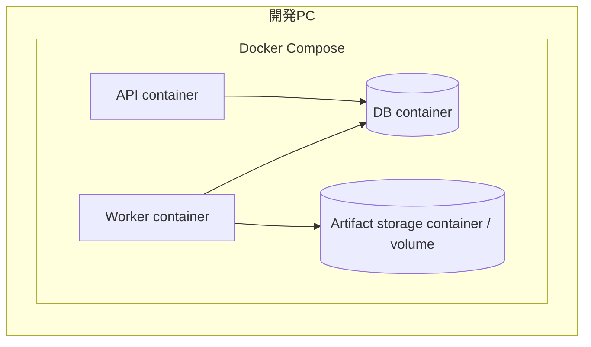

# Dockerで再現できる環境と再現できないもの

> 対象: Card Pulseのローカル開発環境
>
> 最終更新: 2026-09-06

## 1. Dockerを使う目的

Dockerを使う目的は、一台の開発PC上に本番と似たapplication実行環境とservice topologyを、繰り返し作れるようにすることである。

Card Pulseでは、次のserviceをローカルで別々に扱う。

Dockerを使うと、本番と完全に同じ環境になるわけではない。「どの層を再現しているか」を明確にする必要がある。

## 2. 基本要素

| 要素 | 役割 |
| --- | --- |
| Image | OS user space、runtime、library、applicationを作るための再現可能な設計結果 |
| Container | imageから起動した隔離process。VM全体ではなくhost kernelを利用する |
| Volume | containerを削除・再作成しても残す開発用データ |
| Network | service名でAPI、Worker、DB等を接続する仮想network |
| Dockerfile | application imageを作成する手順 |
| Compose file | 複数service、network、volume、環境変数、起動関係の定義 |

macOSやWindows上のLinux containerは、Docker Desktop等が内部のLinux VMを利用する。このため、host OSと同じkernelで直接動いているわけではない。

## 3. Dockerでよく再現できるもの

### Application runtime

- Python等のruntime version
- OS packageとsystem library
- application dependency
- 起動commandとworking directory
- container内のuserとfilesystem layout
- default environment variable

imageをdigestまたは具体versionで固定し、lockfileを使うことで、開発者間とCIで差を減らせる。

### Service topology

- API、Worker、DBを別process・別network endpointとして起動する構成
- service間のhostnameとport
- DBやartifact storageへの接続関係
- 公開portと内部portの違い
- service単位の起動、停止、再起動

同じPC上でも、API process内にWorkerやDBを埋め込まず、service境界を確認できる。

### Database engineとschema

- 本番候補と同じdatabase engine
- 主要version
- database作成と初期設定
- migrationによるschema構築
- test用初期データ
- transaction、constraint、SQL dialectの多く

本番と同じengineを使うことで、開発だけSQLite等へ置き換えた場合に生じる型、JSON、日時、constraint、並行処理の差を減らせる。

### 開発手順

- 一つのcommandによるbuildと起動
- 新しい開発者の環境構築
- 空DBからのmigration
- integration testの依存service
- service停止を使った基本的なfailure test
- volumeを残した再起動と、明示的な初期化

## 4. Dockerだけでは再現できないもの

### Managed serviceの管理機能

ローカルDB containerは、cloudのmanaged databaseと同じDB engineを実行できても、次は同じにならない。

- 自動backupとpoint-in-time recovery
- 自動failoverとreplication
- maintenance windowと自動version update
- provider固有のmonitoringとalert
- connection proxy
- 保存時暗号化とkey management
- provider固有の制限、extension、parameter

これらは試験環境または本番相当環境で検証する。

### Cloud networkとSecurity

- private subnetやVPCの実際のrouting
- firewallとsecurity group
- cloud IAMとworkload identity
- TLS certificateの発行・更新
- DNS
- secret manager
- internetからの攻撃とDDoS対策

Compose networkで「DBを外部公開しない形」は確認できるが、実際のcloud権限とnetwork policyの検証にはならない。

### Trafficと分散環境

- 利用者からserverまでの実network latency
- packet loss、通信断、帯域制限
- load balancerの挙動
- 複数region・複数availability zone
- instanceの自動追加・削除
- rolling deployment中の新旧version混在
- 大量の同時接続と実traffic pattern

必要に応じてstaging、load test、failure injectionで確認する。

### Hardwareとhost OS

- 本番と同じCPU architectureと性能
- disk IOPS、fsync、network storageの遅延
- memory pressureとswap
- kernel versionと設定
- host filesystemのcase sensitivity
- macOS・WindowsとLinux間のbind mount性能

containerにmemoryやCPUの上限を設定しても、本番hardwareの正確なperformance testにはならない。

### Production dataと運用

- 本番相当のデータ量と偏り
- 個人情報・秘密情報を含む実データ
- 長期間動作したDBの肥大化やindex状態
- backupからの実際の復元時間
- 監視通知を受けて人間が対応する流れ
- 障害時の連絡、判断、復旧責任
- 実際の利用料金

本番データをローカルへ複製して再現しない。匿名化または生成した代表データを使う。

## 5. 再現性を層で考える

| 層 | Dockerでの再現度 | 別途必要な検証 |
| --- | --- | --- |
| Application code・dependency | 高い | image buildとsecurity scan |
| DB engine・schema・transaction | 高い | managed版固有設定と負荷 |
| Service間接続 | 高い | cloud network policyと実latency |
| Storage・永続化の基本動作 | 中〜高 | backup、failover、IO性能 |
| Security・IAM | 低〜中 | cloud上の権限・secret・TLS |
| 可用性・自動拡張 | 低い | stagingまたは本番相当環境 |
| 運用・費用 | 低い | 実serviceによる計測と訓練 |

「Dockerで動いた」は、applicationと基本的なservice接続を再現できた証拠である。本番運用の安全性、性能、復旧性まで証明したことにはならない。

## 6. Card Pulseでの利用方針

### Composeに含めるもの

- `api`: Card Digger等からのrequestを受ける。
- `worker`: source取得、原本保存、解析、観測登録を行う。
- `database`: 選定したserver DBと同じengineを動かす。
- `artifact-storage`: 最初はvolumeまたは選定storageと互換のserviceを使う。

schedulerは開発初期には手動commandで代用できる。定期実行の挙動を検証する段階でserviceまたはprofileとして追加する。

### 再現可能にする規則

- base imageとservice imageに曖昧な`latest`だけを指定しない。
- Python dependencyはlockfileで固定する。
- schemaはmigrationだけから作成する。
- sample configurationをrepositoryに置き、秘密値は置かない。
- service readinessをhealth checkで確認する。
- `depends_on`の起動順だけでDBの利用可能状態を保証したと考えない。
- volumeを残す通常停止と、全データを初期化する操作を別commandにする。
- API、Worker、DBを個別に停止し、failure isolationを確認できるようにする。
- container logにcredentialや原本内容を出さない。

### 本番との差を管理する

Compose fileを複雑にしてcloud全体を模倣するのではなく、差を明文化して別の場所で検証する。

| 確認対象 | 主な確認場所 |
| --- | --- |
| Code、dependency、migration | ローカルDockerとCI |
| API・Worker・DBの基本接続 | ローカルDockerとCI |
| managed DB固有機能 | 試験環境 |
| private network、IAM、TLS | 試験環境 |
| rolling deployment | 試験環境 |
| load、可用性、復旧時間 | 試験環境と運用訓練 |
| 実費用 | 利用明細とmonitoring |

## 7. Dockerを使わない処理

すべてをcontainer内で行う必要はない。Editor、Git、簡単な文書編集などはhostでよい。重要なのは、動作結果に影響するruntime、DB、service dependency、migrationの入口を統一することである。

短いunit testまで必ずcontainer内で実行するかは、速度と再現性を比較して決める。ただしDBを使うintegration testは、選定したDB containerを使う。

## 8. Docker以外に必要なもの

本番へ進む前に、Dockerとは別に次を準備する。

- staging環境
- infrastructure設定のversion管理
- secret管理
- migrationとdeploymentのRunbook
- monitoringとalert
- backup・restore test
- load test
- API・Worker・DBの権限分離
- 障害時の復旧手順

Dockerはこれらを不要にするものではない。applicationの実行環境をそろえ、他の検証を始められる安定した土台を作るものとして使う。
