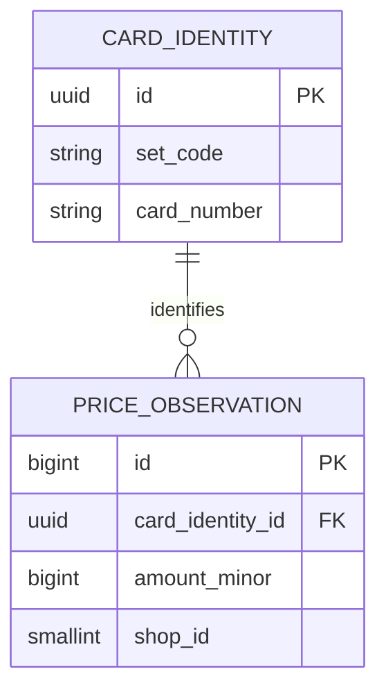
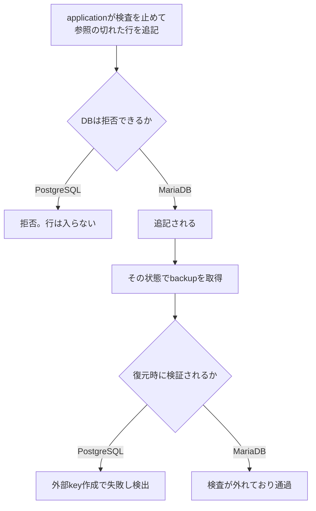

# 外部keyの強制とDB権限

> 対象: Card Pulseの構造化データにおける参照整合と、それをDBのどこで守るか
>
> 最終更新: 2026-09-12

## 1. この文書の目的

[ADR-0014](../adr/0014-postgresql-self-hosted.md)でPostgreSQLを採用した最大の理由は、性能でも容量でも費用でもなく「外部key検査をruntime roleが止められないこと」だった。この理由は誤解されやすい。

特に注意したいのは、**「MariaDBは外部keyを検査しない」「MariaDBが勝手に設定を書き換える」という意味ではない**という点である。両製品とも既定では検査し、DBが自分で設定を変えることはない。差が出るのは、applicationが検査を止める実装を書いてしまった場合に、DBがそれを拒否できるかどうかである。

この文書は、外部keyとは何か、検査はいつ・誰の操作で止まるのか、backupと復元ではどう扱われるのかを整理する。測定結果は[CP-0009 DB PoC結果](../research/database-poc-2026-09.md)、決定は[ADR-0014](../adr/0014-postgresql-self-hosted.md)を正とする。

## 2. 外部keyとは何か

Card Pulseの価格観測は、必ずどれか1枚のカードを参照する。



このとき「`price_observation.card_identity_id`の値は、必ず`card_identity.id`に存在すること」というルールをDBへ登録する。これが外部key（foreign key）である。**DBが自動で検査する**ため、applicationが検査を忘れても守られる。

存在しないUUIDを入れようとすると、DBが行を拒否する。

```sql
INSERT INTO price_observation (..., card_identity_id, ...)
VALUES (..., '95ec2d97-4530-4c1e-a0c0-87c37ae8a7cf', ...);
-- MariaDB:    errno 1452  Cannot add or update a child row: a foreign key constraint fails
-- PostgreSQL: SQLSTATE 23503  violates foreign key constraint
```

外部keyが守るのは「価格が正しいこと」ではなく「**どのカードの価格か辿れること**」である。Card Pulseは[ADR-0002](../adr/0002-append-only-provenance.md)で、観測値から原本まで追跡できることを土台に置いている。参照が切れた行は、金額も店舗も日時も揃っているのに、どのカードの価格なのかを永久に特定できない。

## 3. 参照が切れるとどうなるか

集計queryはカード単位でJOINする。参照先が存在しない行はJOINで落ちるため、**集計結果に現れず、エラーにもならず、件数だけが増える**。取込のlogは成功として残る。

この静かさが問題である。誤った価格ならいずれ目視で気づくが、参照の切れた行は数か月後に総件数を数えたときにしか表面化しない。

## 4. 検査を止める仕組み

両製品とも、外部key検査を一時的に止める手段を持っている。これは機能不足ではなく、正当な用途があるためである。

- 大量データの一括投入では、1行ごとの検査を省く方が速い
- 循環参照を含むschemaでは、投入順序を工夫するより一時的に止める方が単純になる

止め方は製品で異なる。

| | 検査を止める操作 | 有効範囲 |
| --- | --- | --- |
| PostgreSQL | `SET session_replication_role = 'replica'` | そのsessionのみ |
| MariaDB | `SET SESSION foreign_key_checks = 0` | そのsessionのみ |

どちらも**session単位**である。接続を張り直せば既定（検査する）へ戻る。設定fileやDBの永続的な状態を書き換えるものではない。

## 5. 誰が、いつ止めるのか

**自動では止まらない。**DBが勝手にこの設定を変えることはなく、applicationが上記のSQLを明示的に発行したときだけ止まる。書かなければ一生起きない。

したがって現実的な発生経路は、人間またはtoolが書いた場合に限られる。

1. **自分のコードに書く場合**: 取込が外部keyエラーで停止したとき、原因（カード同定が未確定など）を追う代わりに「検査を止めれば通る」という対処を入れてしまう。この対処法はMySQL・MariaDB界隈で広く共有されており、正当な用途があるぶん「危険な書き方」として警告されにくい。
2. **toolが出力する場合**: `mariadb-dump`が生成するSQLは、先頭に`SET FOREIGN_KEY_CHECKS=0`を含む（後述）。

PoCでも一括投入で検査を止める操作を両製品で使った。ただし実行者はadmin roleに限り、投入後に検査を戻して参照整合が0件であることを確認している。runtimeの取込、再解析、同時実行測定では一度も使っていない。

## 6. 製品による差は「拒否できるか」

PoCでは、Worker相当のrole（`SELECT`と`INSERT`、および一部tableの`UPDATE`だけを持つ）で検査を止める操作を試した。

| | Worker roleでの結果 | その後の不正な追記 |
| --- | --- | --- |
| PostgreSQL | 拒否。`permission denied to set parameter "session_replication_role"`（SQLSTATE 42501） | 設定変更の時点で止まるため到達しない |
| MariaDB | 成功 | 存在しないカードを参照する観測を追記できた |

つまり差は次の一点に集約される。

> applicationが「検査を止める」という誤った実装を書いたとき、DBがそれを拒否できるか。

PostgreSQLでは同じコードを書いても効かない。MariaDBでは通る。**間違いが起きなくなるのではなく、間違いが効かなくなる**という違いである。

## 7. backupと復元での扱い

### 取得時に差はない

「backup中にDBが更新されると参照が壊れるのではないか」という懸念は、どちらの製品にも当てはまらない。両方とも、ある一瞬の状態を切り取れる。

- PostgreSQLの`pg_dump`は常に1 transactionのsnapshotから読む
- MariaDBはPoCで使った`--single-transaction`がInnoDBのsnapshotから読む

### 復元時に差が出る

PoCで生成したbackupを復号して中身を確認した結果、次の違いがあった。

**MariaDB**: `mariadb-dump`の出力は先頭でこう指定する。

```sql
/*!40014 SET @OLD_FOREIGN_KEY_CHECKS=@@FOREIGN_KEY_CHECKS, FOREIGN_KEY_CHECKS=0 */;
```

末尾で元へ戻すが、**復元中は外部key検査が働かない**。これは利用者が書いたものではなく、toolが既定で出力する。

**PostgreSQL**: 検査を止めず、順序で解決する。`pg_dump`のcustom形式は復元計画をtable、table data、index、foreign key constraintの順に並べ、外部key制約をすべて最後に作る。**制約を作る時点で既存の全行が検証される**ため、参照の切れた行があれば復元が失敗する。

### 何が違ってくるか

復元は壊れた行を新しく作るわけではない。dumpの内容をそのまま再生するだけである。したがって影響は「壊れを作る」ではなく「**壊れを見つける最後の機会が残るか**」になる。



PostgreSQLは入口と復元の二段で守れる。MariaDBはどちらも素通りする。

## 8. Card Pulseでの方針

[ADR-0014](../adr/0014-postgresql-self-hosted.md)は、この性質を設計の前提として使うと決めた。

- runtime role（APIとWorker）には検査を止める権限を与えない。PostgreSQLではsuperuser専用のため自動的に満たされる。
- 検査を止める必要がある一括投入や移送は、管理者roleの明示的な作業として行い、直後に参照整合を確認する。
- 確定した証拠（原本metadata、抽出結果、観測候補、同定試行、確定観測）に対して、runtime roleへ`UPDATE`と`DELETE`を与えない。具体的なgrantは`CP-0022`で確定する。

なお、PoCの復元検証（件数、代表行のhash、constraint数、原本fileの存在）は参照整合そのものをscanしていない。PostgreSQLではDBが復元時に検証するため追加の検査は要らないが、将来この前提が変わる場合は復元手順へ検査を足す必要がある。

## 9. まとめ

- 外部keyは「どのカードの価格か辿れること」をDBに守らせる仕組みである。
- 検査を止める手段は両製品にあり、正当な用途がある。**DBが自動で止めることはなく、applicationが明示的に発行したときだけ止まる。**
- 差は、その操作をruntime roleに許すかどうか。PostgreSQLは拒否し、MariaDBは許す。
- backup取得時の一貫性に差はない。復元時に検証するか素通りするかが違う。
- Card Pulseは数年分の出典を蓄積するため、静かに壊れて後から気づく種類の問題をDBの権限で止められる方を選んだ。

## 関連文書

- [ADR-0014: 構造化データのDBにPostgreSQL 18を採用し、self-hostで運用する](../adr/0014-postgresql-self-hosted.md)
- [ADR-0002: 原本と価格観測を追記型で保存し、出典を追跡する](../adr/0002-append-only-provenance.md)
- [CP-0009 DB PoC結果](../research/database-poc-2026-09.md)
- [DB要件](../architecture/database-requirements.md)
- [DB選定の判断軸](database-selection.md)
