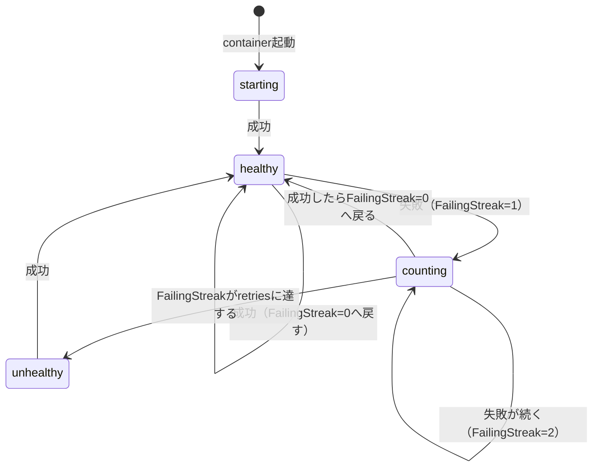
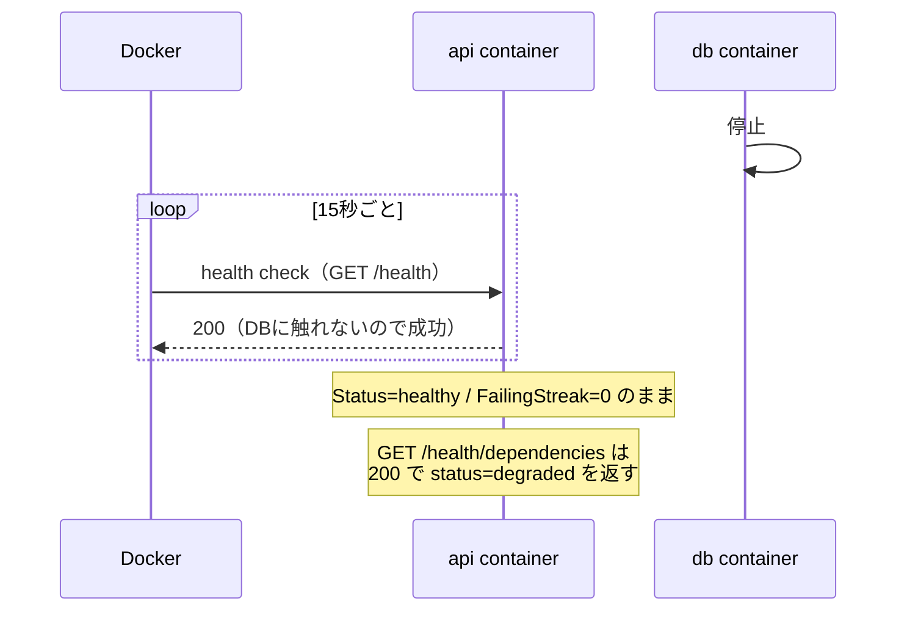

# ヘルスチェックは何を見ているのか

> 対象: container health check、livenessと依存の状態の分離、障害分離をCIで守る方法
>
> 最終更新: 2026-09-15

## 1. この文書の目的

Card Pulseを`docker compose up`で起動し、DBだけを止めてみる。すると次の状態になる。

```
NAME                  SERVICE   STATUS
card-pulse-api-1      api       Up (healthy)     ← DBが落ちているのにhealthy
card-pulse-worker-1   worker    Up (healthy)     ← 同上
card-pulse-db-1       db        Exited
```

これはバグではない。**意図してそう作っている**（[ADR-0016](../adr/0016-local-compose-artifact-volume.md)）。

「containerがhealthyなら、そのserviceは正しく仕事ができる」という読み方は、この構成では成り立たない。この文書は、なぜそう決めたのか、では依存の異常はどこで分かるのか、そしてその設計が将来壊されていないことをどうやって守るのかを説明する。

決定そのものは[ADR-0016](../adr/0016-local-compose-artifact-volume.md)と[ADR-0005](../adr/0005-separate-runtime-services.md)を正とする。

## 2. 前提: health checkとは何か

### 2.1 Dockerが定期的にコマンドを実行する

health checkは、Dockerが一定間隔で実行する**ただのコマンド**である。終了コードが`0`なら成功、それ以外は失敗として扱われる。

`compose.yaml`のAPIの設定が実物である。

```yaml
healthcheck:
  test: ["CMD", "python", "-m", "card_pulse.entrypoints.api.healthcheck"]
  interval: 15s      # 15秒ごとに実行する
  timeout: 5s        # 5秒で返らなければ失敗とみなす
  retries: 3         # 3回連続で失敗したらunhealthyにする
  start_period: 20s  # 起動直後のこの時間は失敗を数えない
```

`start_period`があるのは、起動に時間のかかるprocessを「まだ準備中」と「壊れている」で区別するためである。

### 2.2 Dockerが記録する3つの値

`docker inspect`で各containerのhealth状態を読める。ここが混乱しやすいので整理する。

| 値 | 意味 | 例 |
| --- | --- | --- |
| `Status` | 総合判定 | `starting` / `healthy` / `unhealthy` |
| `FailingStreak` | **連続で**何回失敗しているか | `0`、`1`、`2` … |
| `Log` | 直近5回の実行結果（開始時刻、終了コード、出力） | 配列 |

重要なのは3つとも**そのcontainer自身のhealth checkについての値**だという点である。`db`のhealth checkの結果を`api`が持つことはない。3つのcontainerがそれぞれ自分の値を持つ。

```bash
docker inspect --format '{{json .State.Health}}' "$(docker compose ps -q api)"
```

### 2.3 StatusとFailingStreakの関係

Dockerは`interval`ごとにコマンドを実行し、次のように更新する。



図の`counting`は説明のために置いた状態で、Dockerの`Status`としては`healthy`のままである。つまり：

- **`FailingStreak`は1回目の失敗で動く**
- **`Status`は`retries`回目の失敗ではじめて変わる**

`interval: 15s`・`retries: 3`なら、最初の失敗から`unhealthy`になるまで最大45秒の差がある。この差は7.2節で効いてくる。

## 3. 「動いている」には2種類ある

サービスの状態を問うとき、まったく別の2つの問いが混ざりやすい。

| 問い | 呼び方 | 例 |
| --- | --- | --- |
| このプロセスは生きていて応答するか | **liveness**（生存） | HTTPサーバーがリクエストを受けられる |
| このプロセスは仕事ができるか | **依存の状態** | DBに繋がる、保存先に書ける |

この2つは独立している。**プロセスは完全に健全なのに、DBが落ちているせいで仕事ができない**という状態は普通に起こる。

どちらをhealth checkの結果にするかは設計判断であり、正解は用途で変わる。

## 4. Card Pulseの選択

### 4.1 health checkはlivenessだけを表す

[ADR-0016](../adr/0016-local-compose-artifact-volume.md)は、health checkをlivenessに限り、依存の状態は別経路で報告すると決めた。

| service | health checkが見るもの | DBに触るか |
| --- | --- | --- |
| `db` | `pg_isready`（自分自身） | — |
| `api` | `GET /health`が200を返すか | **触らない** |
| `worker` | heartbeat fileが新しいか | **触らない** |

依存の状態は別の経路で報告する。

| service | 依存を報告する場所 | 異常時の振る舞い |
| --- | --- | --- |
| `api` | `GET /health/dependencies` | **HTTP 200**のまま`"status": "degraded"` |
| `worker` | heartbeat fileの中身 | `"status": "degraded"`として書き続ける |

`/health/dependencies`が異常時も200を返すのは重要である。500やconnection refusedにしてしまうと、**落ちたAPIと、生きていて異常を報告しているAPI**を呼ぶ側が区別できない。

### 4.2 なぜ依存をhealth checkに含めないのか

含めた場合に何が起きるかを考えると分かりやすい。


[ADR-0005](../adr/0005-separate-runtime-services.md)は、API・Collection Worker・DBを別のruntimeに分けることで「Collectorの障害をAPIへ波及させない」ことを狙っている。依存の失敗をhealth checkの失敗にすると、この性質をローカルで観察できなくなる。DBを止めた瞬間に全部が赤くなり、**どこが壊れたのかが分からない**。

さらに実害がある。health checkの失敗は再起動やトラフィック遮断の引き金として使われるのが普通である。DBが一時的に落ちただけで、正常に動いていて状況を正しく報告しているAPIとWorkerまで再起動されてしまう。

## 5. 実際にDBを止めるとどうなるか

手元で確認できる（手順は[ローカル開発環境Runbook](../runbooks/local-development.md)を正とする）。

```bash
docker compose stop db
```



実測（Colima、macOS arm64）では次のようになった。

```json
{
  "service": "api",
  "status": "degraded",
  "dependencies": [
    {
      "name": "database",
      "healthy": false,
      "detail": "OperationalError: failed to resolve host 'db': [Errno -2] Name or service not known"
    }
  ]
}
```

Workerのheartbeat fileも同じ構造で、`database`だけが`healthy: false`、`artifact-storage`は`true`のまま書かれ続ける。**heartbeatが`degraded`であること自体が、DBが落ちた後に書かれた証拠**になる。probeが失敗しなければこの値にならないためである。

`docker compose start db`で復帰させると、APIは即座に`ok`へ戻り、Workerは巡回間隔（30秒）ぶん遅れて戻る。

## 6. この設計が引き受けた弱点

livenessだけを見ると決めた以上、**「containerはhealthyだがDBが落ちている」という状態が成立する**。ADR-0016のConsequencesにも明記されている。

問題は、その状態を誰がいつ知るのかである。`/health/dependencies`もheartbeatも「聞かれたら答える」だけで、能動的に知らせる仕組みがない。人が`curl`しに行かなければ、`degraded`のまま何日も動き続ける。

これは未解決の課題として`CP-0091`が引き受けている。設計上の欠陥ではなく、**分離を選んだ結果として別に用意しなければならないもの**である。

## 7. 設計が壊れていないことをCIで守る

ここからが実践的な話になる。

### 7.1 手動確認は1回しか効かない

ここまでの性質は`CP-0012`と`CP-0061`で手元で確認された。しかしCIは正常系（全部healthy、依存も`ok`）しか通していなかった。

つまり、誰かが「health checkでDBも見たほうが親切では」と考えてコードを変えても、**CIは全部緑のまま通る**。ADR-0005とADR-0016が土台にしている障害分離が静かに失われる。

テストになっていない決定は、覚えている人がいる間しか守られない。

### 7.2 何を検査するか

`CP-0092`で`Compose environment` jobへ次の手順を足した。

| 順 | 操作 | 確認すること |
| --- | --- | --- |
| 1 | `docker compose stop db` | — |
| 2 | 35秒待って`docker inspect` | `api`と`worker`が`healthy`、`FailingStreak`が`0`、再起動回数が`0` |
| 3 | `/health/dependencies`を叩く | HTTP **200**、`degraded`、`database`に失敗理由がある |
| 4 | heartbeatを読む | `degraded`、`database`だけが`healthy: false` |
| 5 | `docker compose start db` | — |
| 6 | pollingで待つ | 両方が`ok`へ戻る |

### 7.3 なぜ`Status`ではなく`FailingStreak`を見るのか

2.3節の「`FailingStreak`が先に動き、`Status`は後から変わる」がここで効く。

DBを止めてからのAPIの様子を、2つの場合で並べる。

| 経過 | いまの実装（DBを見ない） | もし依存も見る形に変わったら |
| --- | --- | --- |
| 0秒（DB停止） | streak=0 / `healthy` | streak=0 / `healthy` |
| 15秒 | 成功 → 0 / `healthy` | 失敗 → **1** / `healthy` |
| 30秒 | 成功 → 0 / `healthy` | 失敗 → **2** / `healthy` |
| **35秒（検査する時点）** | **0 / `healthy`** | **2 / `healthy`** |
| 45秒 | 成功 → 0 / `healthy` | 失敗 → 3 / **`unhealthy`** |

**35秒の時点では、正常な実装も壊れた実装も`Status`は`healthy`である。** `Status`だけを見る検査では区別できない。差が出るのは`FailingStreak`だけである。

`Status`で判定するなら45〜60秒待つ必要がある。`FailingStreak`なら35秒で足りるうえ、「health checkが一度も失敗していない」ことを直接確認できる。

実際にAPIのhealth checkを`/health/dependencies`を見る形へ差し替えて検証したところ、35秒時点で次のようになった。

```
PATCHED api: health=healthy failing_streak=2
```

`Status`はまだ`healthy`である。**`unhealthy`化だけを待つ検査だったら、この変更を見逃していた。**

### 7.4 検査は「失敗することを確かめて」はじめて検査になる

7.3の差し替え確認がこの節の要点である。

検査を書いたら、**守りたい性質を意図的に壊して、その検査が実際に落ちることを確認する**。落ちなければ、その検査は何も守っていない。通っていることだけを見ても、検査が機能しているかは分からない。

Card Pulseのロードマップが各タスクの`Evidence`に「Xを壊すと検査が失敗することを確認した」と書いているのは、この理由による。

## 8. よくある誤解

| 誤解 | 正しい理解 |
| --- | --- |
| containerが`healthy`なら、そのserviceは仕事ができる | `healthy`が意味するのはlivenessだけ。DBが落ちていても`healthy`になる |
| `api`が`healthy`なのでDBも正常だ | health checkはDBに触らない。DBの状態は`/health/dependencies`で見る |
| `FailingStreak`はDBの状態を表す | そのcontainer自身のhealth checkが連続で何回失敗したかを表す |
| `FailingStreak`はDBへの再接続回数 | DBには一切アクセスしない。health checkコマンドの実行結果を数えているだけ |
| CIが緑なら設計は守られている | 正常系しか通していなければ、設計が壊れても緑のまま通る |
| 依存も見るhealth checkのほうが親切 | 障害の切り分けができなくなり、健全なserviceまで再起動される |

## 9. 用語

| 用語 | 意味 |
| --- | --- |
| liveness | プロセスが生きていて応答できること。仕事ができるかは含まない |
| health check | Dockerが一定間隔で実行するコマンド。終了コード0が成功 |
| `Status` | Dockerのhealth総合判定。`starting` / `healthy` / `unhealthy` |
| `FailingStreak` | health checkが連続で失敗した回数。成功すると0に戻る |
| `retries` | `FailingStreak`がこの値に達すると`unhealthy`になる |
| `interval` | health checkを実行する間隔 |
| `start_period` | 起動直後の猶予。この間の失敗は数えない |
| degraded | プロセスは生きているが、依存の一部が使えない状態 |
| heartbeat | Workerが定期的に書き出すfile。新しさがlivenessを表す |
| 障害分離 | 一つのserviceの障害を他へ波及させないこと |

## 10. 関連文書

- [ADR-0016](../adr/0016-local-compose-artifact-volume.md)（health checkをlivenessに限る判断）
- [ADR-0005](../adr/0005-separate-runtime-services.md)（runtimeを分けて障害を分離する）
- [ADR-0006](../adr/0006-docker-compose-local-development.md)（ローカルのservice構成）
- [アーキテクチャ概要](../architecture/overview.md)（service構成と接続経路）
- [ローカル開発環境Runbook](../runbooks/local-development.md)（起動、停止、DBを止めた場合の確認手順）
- [Dockerで再現できる環境と再現できないもの](docker-environment-reproduction.md)（containerとvolumeの基礎）
- [private networkの種類と使い分け](private-network-types.md)（bindと公開範囲）
