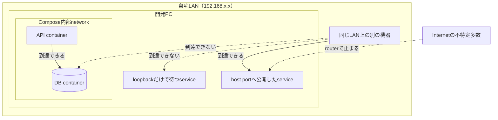
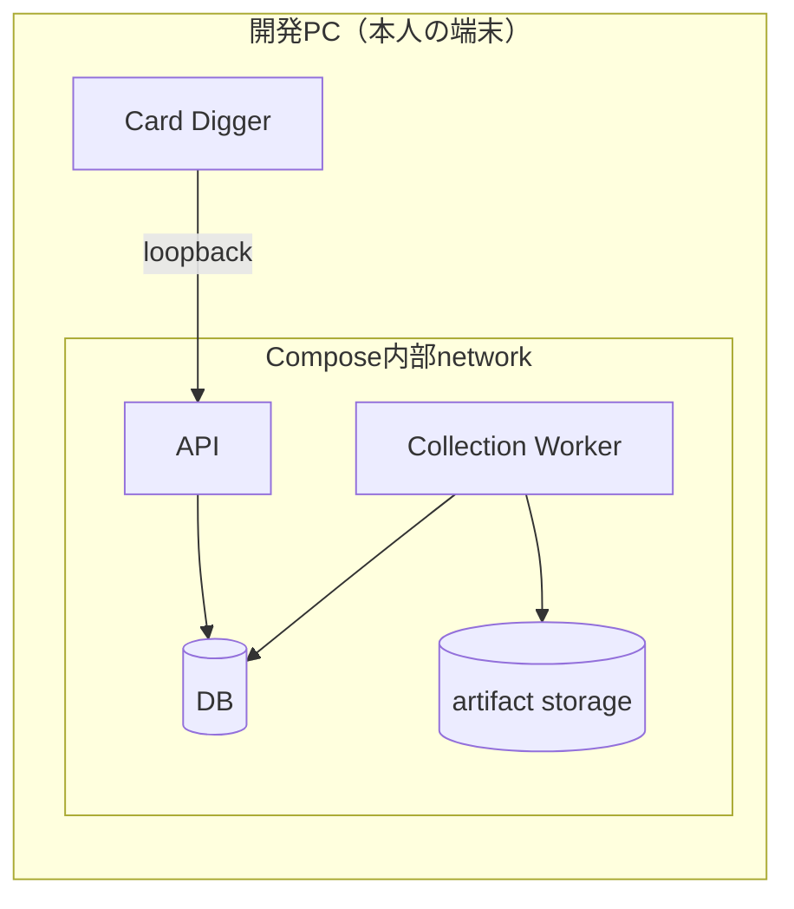
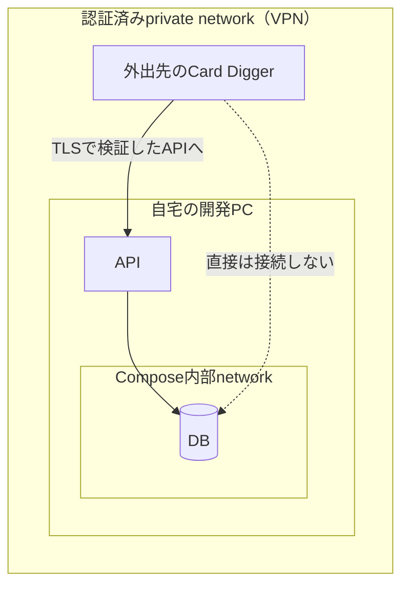

# private networkの種類と使い分け

> 対象: Card PulseのAPI、Collection Worker、DB、artifact storage、Card Diggerを接続する経路
>
> 最終更新: 2026-09-12

## 1. この文書の目的

Card Pulseの文書には「private network」が繰り返し出てくる。

- [ADR-0012](../adr/0012-private-personal-operation.md): 「API、Collection Worker、DB、artifact storageは本人が管理する端末またはprivate network内だけで実行する」
- [DB要件](../architecture/database-requirements.md)の`DB-SEC-01`: 「DB portをInternetへ公開しないこと。同一hostではCompose内部network、hostをまたぐ場合は認証済みprivate networkとserver証明書を検証するTLSを使うこと」
- [MVP定義](../product/mvp.md): 「APIとCollection Workerを別サービスとして本人の端末またはprivate network内で実行」

しかし「private network」は一つの技術の名前ではなく、**到達できる範囲が限定されたnetworkの総称**である。実際には範囲の広さが違う何種類かがあり、どれを指しているかで満たせる要件が変わる。この文書はその種類と使い分けを整理する。

DB製品の選び方そのものは[DB選定の判断軸](database-selection.md)、Docker環境の再現範囲は[Dockerで再現できる環境と再現できないもの](docker-environment-reproduction.md)を参照する。

## 2. private networkとは何か

private networkとは、**そのnetworkの外にいる機器からは、そもそもパケットが届かないnetwork**である。Internet（公開網）の対義語として使う。

ここでいう「届かない」は、次の意味である。

- 相手のIPアドレスとport番号を知っていても、TCP接続を試すことすらできない
- 認証画面やerror応答さえ返らない。通信が経路上で捨てられる

つまりprivate networkは「侵入を防ぐ仕組み」ではなく、**攻撃を試せる相手の数そのものを減らす仕組み**である。この考え方をattack surface（攻撃面）の削減と呼ぶ。

実線が到達できる経路、点線が到達できない経路である。同じ「開発PCの中」でも、serviceがどこで待っているかによって到達できる相手が変わる点が重要になる。

## 3. 前提知識

### 3.1 private IPアドレス

IPv4には、Internet上へ経路情報を流さないと決められたアドレス範囲がある。

| 範囲 | 代表的な用途 |
| --- | --- |
| `10.0.0.0/8` | 企業network、VPN |
| `172.16.0.0/12` | Dockerの既定bridge network等 |
| `192.168.0.0/16` | 家庭用router配下のLAN |
| `127.0.0.0/8` | loopback。自分自身のみ |

`10`、`172.16`、`192.168`の3範囲は[RFC 1918](https://datatracker.ietf.org/doc/html/rfc1918)（確認日: 2026-09-12）が定めており、「private networkの経路情報を組織間linkへ流さず、private addressを送信元・宛先に持つpacketをそうしたlinkへ転送しない」と規定されている。これが「private IPにはInternetから直接届かない」根拠である。

ただし、**private IPであることは安全を意味しない**。同じLANの中にいる機器からは普通に到達できる。

### 3.2 bindとlisten

serviceは起動時に「どのIPアドレスのどのportで接続を待つか」を決める。これをbindと呼ぶ。**到達できる範囲を最初に決めるのはこのbind先**であり、ここを理解していないと他の設定がすべて無意味になる。

| bind先 | 意味 |
| --- | --- |
| `127.0.0.1` | 自分自身からの接続だけを受ける |
| `0.0.0.0` | その機器が持つすべてのnetwork interfaceで受ける |
| 特定のIP | そのinterface経由の接続だけを受ける |

container内部のprocessは、そのcontainer専用のnetwork空間を持つ。**container内で`127.0.0.1`にbindすると、他のcontainerからも接続できない**。DB containerが`0.0.0.0`で待つのは正しく、危険なのは次に説明する「hostへの公開」のほうである。

## 4. private networkの種類

範囲が狭い順に4種類ある。狭いほど安全で、広いほど便利という関係になる。

| 種類 | 到達できる範囲 | 参加の条件 | 場所の制約 | Card Pulseでの用途 |
| --- | --- | --- | --- | --- |
| loopback | 同じ1台（またはcontainer）の中だけ | なし。その機器で動いていること | 同一機器 | APIの既定のbind先 |
| Compose内部network | 同じCompose内のcontainer同士 | 同じComposeで起動していること | 同一host | **DBの既定の置き場所** |
| LAN | 同じrouter配下の機器すべて | そのWi-Fi・有線に接続できること | 同一拠点 | 家の中でCard Diggerを使う場合 |
| 認証済みprivate network（VPN） | 参加を認証された機器だけ | 鍵またはアカウントによる認証 | 制約なし | 外出先からCard Diggerを使う場合 |

### 4.1 loopback

自分自身を指す仮想的なnetwork interfaceである。`127.0.0.1`にbindしたserviceは、同じ機器の中のprocessからしか接続できない。

- **長所**: 最も範囲が狭い。network設定の誤りで外へ漏れることがない
- **短所**: 別の機器からは一切使えない
- **Card Pulseでの位置づけ**: [アーキテクチャ概要](../architecture/overview.md)のとおり、APIは既定でloopbackまたはCompose内部networkだけにbindする

### 4.2 Docker Compose内部network

Composeは、定義したserviceを同じ仮想bridge networkへ接続する。container同士はservice名で名前解決して通信でき、外部からは見えない。

- **長所**: 設定が単純で、`ports`を書かない限り外へ出ない。開発PC1台で完結する
- **短所**: hostをまたげない
- **Card Pulseでの位置づけ**: `DB-SEC-01`が「同一hostではCompose内部network」と指定している既定の置き場所

ここで最も多い事故が、**`ports`の書き方でhostへ公開してしまう**ことである。Compose公式docsは「host IP（`127.0.0.1`等）を指定しない場合、Dockerはすべてのinterface（`0.0.0.0`）へbindする」と明記している（[Compose file reference](https://docs.docker.com/reference/compose-file/services/#ports)、確認日: 2026-09-12）。

| 書き方 | 他のcontainerから | 同じPCの別process | 同じLANの別機器 |
| --- | --- | --- | --- |
| `ports`を書かない | 到達できる | 到達できない | 到達できない |
| `ports: "127.0.0.1:5432:5432"` | 到達できる | 到達できる | 到達できない |
| `ports: "5432:5432"` | 到達できる | 到達できる | **到達できる** |

この表はDocker Desktop（macOS）を前提とする。hostとcontainerの間にVMがあるため、`ports`を書かない限りhost側のprocessはcontainerへ到達できない。Linux上のDockerではhostがbridge networkへ直接到達できるため、「同じPCの別process」の列は当てはまらない。

GUI toolからDBを覗くために`ports: "5432:5432"`と書くと、その瞬間に同じWi-Fi上の全機器から接続を試せる状態になる。必要な場合は`127.0.0.1:`を必ず付ける。なお`expose`はhostへの公開を行わず、同じnetwork上のcontainerに向けた宣言にとどまる。

### 4.3 LAN（家庭内network）

家庭用routerがNATで内側と外側を分けているため、Internet側から内側の機器へは原則として接続できない。

- **長所**: 特別な準備なしに、家の中の複数機器から使える
- **短所**: **参加に認証がない**。Wi-Fiにつながった機器はすべて中にいる扱いになる
- **落とし穴**:
  - port forwardingやUPnPを有効にすると、意図せずInternetへ公開される
  - 来客用に共有したWi-Fi、家族の端末、IoT機器も同じLANの内側にいる
  - LAN内の1台がマルウェアに感染すると、そこからDBへ接続を試せる

`DB-SEC-01`がhostをまたぐ場合に「**認証済み**private network」と限定しているのは、LANだけでは参加者を絞れないためである。

### 4.4 認証済みprivate network（VPN）

VPNは、物理的なnetworkの上に暗号化された仮想networkを重ねる（overlay network）。参加するには鍵またはアカウントによる認証が必要で、参加した機器同士はどこにいても同じprivate network上にいるかのように通信できる。

代表的な実装は次の2つである。

| 実装 | 仕組み |
| --- | --- |
| [WireGuard](https://www.wireguard.com/)（確認日: 2026-09-12） | 公開鍵暗号でpeerを認証する軽量VPN。公式資料は「双方が相手の公開鍵を持っていれば、そのinterface経由でpacketの交換を始められる」と説明する。SSHの鍵交換に近い |
| [Tailscale](https://tailscale.com/kb/1151/what-is-tailscale)（確認日: 2026-09-12） | WireGuardを基盤に、アカウント認証で参加機器を管理するmesh型overlay network。公式資料は「WireGuardプロトコルを使うため、自分のprivate network上の機器同士だけが通信できる」と説明する |

- **長所**: 場所に依存せず、参加者を認証で絞れる。外出先からでも使える
- **短所**: 追加のsoftwareと鍵・アカウント管理が増える
- **Card Pulseでの位置づけ**: 将来、外出先のCard DiggerからAPIを使う場合の想定経路。BaaSやクラウドhostingの代わりにこちらで解く方針を[DB候補比較](../research/database-candidate-comparison-2026-09.md)に記録している

## 5. private networkとTLS・認証の違い

3つはどれも必要で、互いの代わりにはならない。守っている対象が違うためである。

| 手段 | 守る対象 | 攻撃者から見た状態 |
| --- | --- | --- |
| private network | 接続を試せる相手の範囲 | packetが届かない。試行自体ができない |
| TLS | 通信経路上の盗聴と改ざん | 接続は試せる。中身が読めないだけ |
| 認証・role分離 | 正しい資格情報を持たない操作 | 接続は試せる。総当たりや脆弱性を狙える |

`DB-SEC-01`が「認証済みprivate network**と**server証明書を検証するTLS」と両方を要求しているのはこのためである。TLSは`verify-full`のようにserver証明書を検証する設定で使い、暗号化されていることだけを根拠にしない。

保存時暗号化との違いは[DB選定の判断軸](database-selection.md)の「TLSと保存時暗号化は何を暗号化するか」に整理してある。

## 6. Card Pulseでの適用

### 6.1 現在（Phase 1で作る構成）

すべてを開発PC 1台の中に閉じる。DBはCompose内部networkにだけ置き、host portへ公開しない。

### 6.2 将来（hostをまたぐ場合）

外出先のCard Diggerから使う場合も、**clientはDBへ直接接続しない**。[ADR-0004](../adr/0004-server-database-selection.md)のとおりAPI経由に限定し、端末へDB credentialを配布しない。VPNへ参加させるのは端末であり、DBを公開するわけではない。

### 6.3 要件との対応

| 要件 | 満たす手段 |
| --- | --- |
| `DB-SEC-01`（同一host） | DBをCompose内部networkに置き、`ports`でhostへ公開しない |
| `DB-SEC-01`（hostをまたぐ） | VPNで参加機器を認証し、TLSはserver証明書を検証する設定にする |
| ADR-0012（Internetから到達不能） | APIをloopbackまたはCompose内部networkへbindする |
| ADR-0004（clientはDBへ直接接続しない） | 端末にはAPIだけを見せ、DB credentialを配布しない |

## 7. よくある誤解

- **「強いパスワードがあるならInternetへ公開してよい」** — 認証は接続を試された後の防御である。公開した時点で総当たりと実装の脆弱性の対象になる
- **「TLSがあればprivate networkと同じ」** — TLSは中身を守るだけで、接続を試せる相手は減らない
- **「private IPだから安全」** — 同じLANの機器からは到達できる。家族の端末、来客、IoT機器も内側にいる
- **「routerがあるから`0.0.0.0`にbindしても届かない」** — Internetからは届かないが、同じLANからは届く
- **「`ports`はデバッグ用に付けただけ」** — host IPを省くと`0.0.0.0`公開になる。`127.0.0.1:`を付ける
- **「クラウドDBもIP制限すれば同じ」** — 経路は公開網のままである。この差が[DB候補比較](../research/database-candidate-comparison-2026-09.md)でBaaSを採らない理由になっている

## 8. 確認方法

構成を信用せず、実際に到達できるかを確かめる。

| 確認したいこと | コマンド（macOS） | 期待する結果 |
| --- | --- | --- |
| 何がどのアドレスで待っているか | `lsof -nP -iTCP -sTCP:LISTEN` | DBが`0.0.0.0`でhost側に出ていない |
| Composeが公開しているport | `docker compose ps` | DB serviceのPORTS列にhost側の公開がない |
| 自分のLAN IP | `ipconfig getifaddr en0` | 次の確認に使う |
| 別の機器から到達するか | 別端末で`nc -vz <LAN IP> 5432` | 接続が成立しない |

`DB-SEC-01`とADR-0012は、この種の確認をtestまたは構成検査で行うことを求めている。

## 9. 用語

| 用語 | 意味 |
| --- | --- |
| loopback | 自分自身を指す仮想interface（`127.0.0.1`）。同一機器内の通信だけに使う |
| bind | serviceが「どのアドレスのどのportで待つか」を決めること |
| NAT | routerが内側のprivate addressと外側のglobal addressを変換する仕組み。結果として外からの接続開始を遮る |
| overlay network | 既存のnetworkの上に構築する仮想network。VPNがこれにあたる |
| attack surface | 攻撃を試せる経路や入口の総量。private networkはこれを減らす |
| 多層防御 | private network、TLS、認証のように、役割の違う対策を重ねる考え方 |

## 10. 関連文書

- [DB要件](../architecture/database-requirements.md)（`DB-SEC-01`とsecurity要件）
- [アーキテクチャ概要](../architecture/overview.md)（service構成と接続経路）
- [ADR-0012](../adr/0012-private-personal-operation.md)（個人用の非公開運用）
- [ADR-0004](../adr/0004-server-database-selection.md)（clientはAPI経由でのみ利用する）
- [DB選定の判断軸](database-selection.md)（TLSと保存時暗号化の違い）
- [Dockerで再現できる環境と再現できないもの](docker-environment-reproduction.md)
- [CP-0008 DB候補比較](../research/database-candidate-comparison-2026-09.md)（hosting方式とBaaSの検討）
