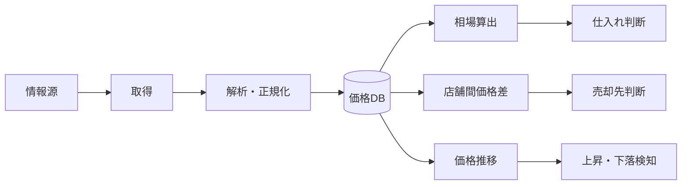
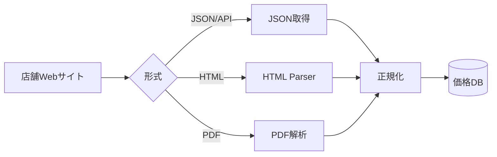
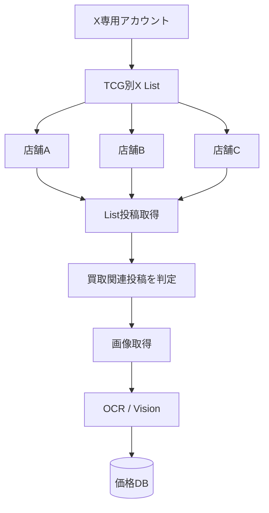
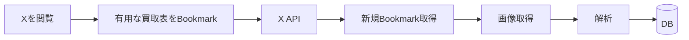
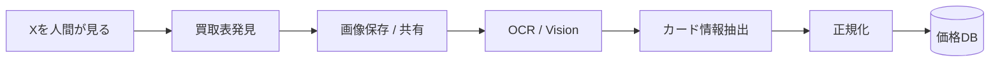
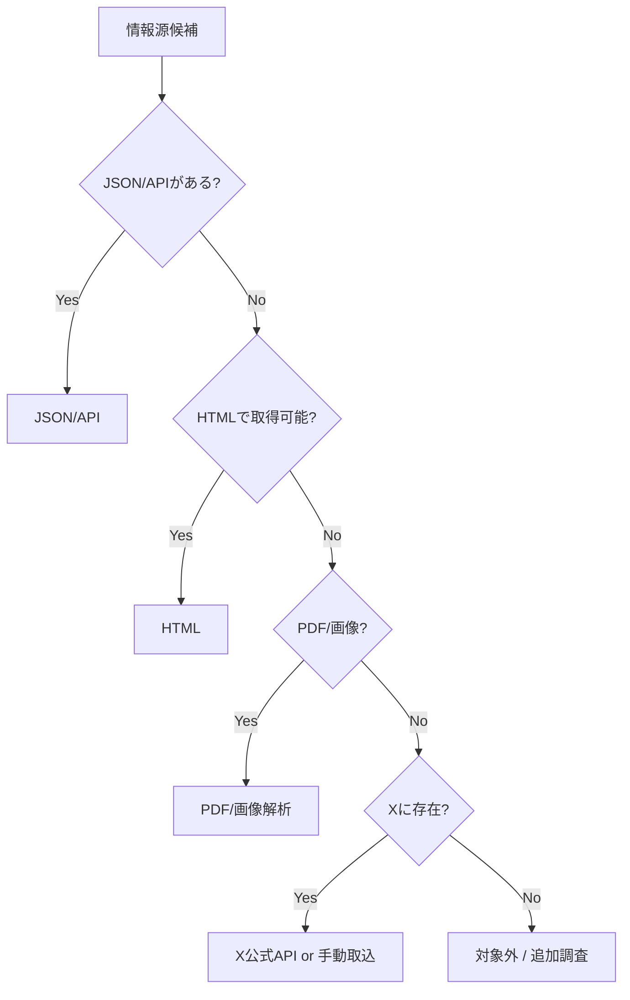
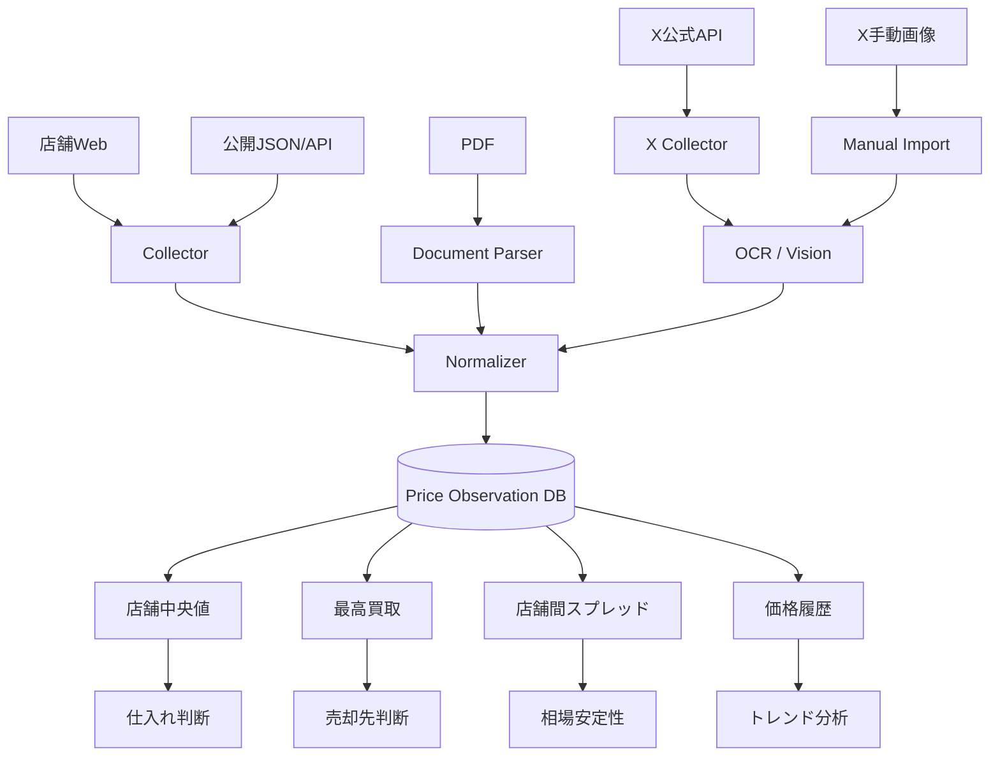

# TCG相場情報の収集方法まとめ

> 文書種別: 調査資料
>
> 基準日: 2026-09-04
>
> 状態: 調査時点の情報。採用方針はADRと `docs/product/mvp.md` を正とする

## 1. 目的

本ドキュメントでは、TCG（トレーディングカードゲーム）の仕入れ・売却判断に必要な**相場情報を効率よく収集し、DBへ蓄積する方法**を整理する。

特に、カードショップがX（旧Twitter）やWebサイトで公開している**買取表**を中心に、以下の観点で比較する。

- どのように情報へアクセスするか
- 自動化できるか
- コストはいくらか
- 長期運用に向いているか
- 規約・安定性のリスクはあるか
- 画像形式の買取表をどう構造化するか

---

## 2. 最終的に作りたい仕組み

目標は、単に「今日の買取価格」を見ることではなく、**店舗ごとの価格履歴を継続的に保存し、相場・売却先・仕入れ候補を判断できる状態**を作ることである。



### 保存したい主な情報

| 項目 | 例 | 意味 |
|---|---|---|
| TCG | 遊戯王 | カードゲーム種別 |
| カード名 | 青眼の白龍 | 表示名 |
| カード番号 | SM-51 など | 同名カード識別に重要 |
| レアリティ | UL / UR / SEC など | 同一カードの仕様差 |
| 店舗 | 店舗A | 買取元 |
| 買取価格 | 80,000円 | 即時売却可能価格の目安 |
| 投稿日時 | 2026-09-04 10:30 | 情報が公開された時刻 |
| 取得日時 | 2026-09-04 11:00 | システムが取得した時刻 |
| 有効期限 | 2026-09-06まで | 買取価格の期限 |
| 状態条件 | 美品のみ | 査定条件 |
| 情報源 | Web / X / PDF | 出典の種類 |
| Source ID / URL | Post IDなど | 再確認用 |

---

# 3. 相場情報の取得方法

大きく分けて、以下の5つの方法が考えられる。

| 方法 | 自動化 | 安定性 | コスト | 導入難易度 | 推奨度 |
|---|---:|---:|---:|---:|---:|
| 公式Webサイト/API | ◎ | ◎ | 無料〜低 | ○ | ★★★★★ |
| X公式API | ◎ | ◎ | 有料 | ○ | ★★★★☆ |
| X非公式OSS | ◎ | △ | 無料 | △〜高 | ★★☆☆☆ |
| 手動選別 + OSS解析 | ○ | ◎ | ほぼ無料 | ◎ | ★★★★★ |
| PDF・画像ファイル収集 | ○〜◎ | ○ | 無料〜低 | ○ | ★★★★☆ |

---

# 4. 方法1：カードショップの公式Webサイト/APIから取得

## 概要

カードショップがWebサイト上に掲載している買取価格を直接取得する方法。

情報がHTMLやJSONとして公開されていれば、X画像よりも扱いやすい。

## 手法



### 取得優先順位

1. 公開API / JSON
2. HTML
3. PDF
4. 画像

APIやJSONが最も構造化されているため、優先度が高い。

## メリット

- 無料で取得できるケースが多い
- X APIを使わなくてよい
- HTMLやJSONならOCRが不要
- カード番号・価格などを正確に取得しやすい
- 定期取得しやすい
- 店舗公式データなので信頼性が高い

## デメリット

- 店舗ごとにWeb構造が異なる
- JavaScriptレンダリングの場合は取得が複雑
- サイト変更でParserが壊れる可能性がある
- robots.txtや利用規約を確認する必要がある
- Xだけに掲載される高価買取情報を取りこぼすことがある

## コスト

| 項目 | コスト |
|---|---:|
| HTTP取得 | ほぼ0円 |
| SQLite | 0円 |
| 自宅PC/Macで定期実行 | 0円 |
| VPS利用 | 月数百〜数千円程度 |

### 評価

**最優先で使うべき方法。**

XとWebの両方に同じ買取情報がある場合、基本的にはWebを優先する。

---

# 5. 方法2：X公式APIを利用

## 概要

Xが提供している公式APIから、店舗アカウントの投稿・List・Likes・Bookmarksなどを取得する方法。

今回の用途では特に以下が有効。

- 店舗アカウントをまとめた **X List**
- 自分が選別した **Bookmarks**
- 必要に応じて Likes

## 手法A：X Listによる自動収集



### 例

- Yu-Gi-Oh Buylist Sources
- Pokémon Buylist Sources
- Duel Masters Buylist Sources

といったListを作り、買取表を頻繁に投稿するショップだけを登録する。

## 手法B：Bookmarkを取込キューとして使う



この方式では、人間が「価値のある買取表か」を判断し、面倒な入力作業のみ自動化する。

## メリット

- Xの公式手段なので長期運用しやすい
- Listで情報源を限定できる
- Bookmarkを手動選別キューにできる
- 投稿日時・Post ID・画像情報を取得しやすい
- X全体を無作為検索するより効率的
- 店舗Webに掲載されない高価買取情報を取得できる

## デメリット

- API利用料が発生する
- API仕様変更への対応が必要
- X APIのRate Limitや料金体系に依存する
- 画像買取表の場合は別途OCR/Vision解析が必要

## コスト

2026年9月時点で確認した料金イメージ：

| 種類 | 目安 |
|---|---:|
| 通常のPost Read | 約 $0.005 / 件 |
| 自分のLikes / Bookmarks等のOwned Read | 約 $0.001 / 件 |

### 例

月500件のBookmarkを取得する場合、Post Read部分だけなら概算で：

```text
500 × $0.001 = $0.50 / 月
```

※画像取得・その他API呼び出し、料金改定は別途確認が必要。

### 評価

**完全自動化するなら最も安全で安定したX取得方法。**

ただし、MVP段階では必須ではない。

---

# 6. 方法3：X非公式OSSを使用

X公式APIを利用せず、OSSを使ってXの投稿を取得する方法。

代表例：

- twscrape
- Nitter
- snscrape（現在は新規採用しにくい）

---

## 6.1 twscrape

### 概要

Python製の非公式Xスクレイピングライブラリ。

Search、User Posts、Bookmarks、List Timeline、Mediaなどを扱える。

### 手法

```text
Xアカウント
   ↓
twscrape
   ↓
List / Bookmark / Search
   ↓
投稿・画像
   ↓
解析
   ↓
DB
```

### メリット

- 無料
- Pythonから扱いやすい
- Bookmark/Listなど今回の用途に合う機能がある
- X公式API料金が不要

### デメリット

- X公式APIではない
- Xの内部GraphQL等に依存
- X側の仕様変更で突然動かなくなる可能性がある
- アカウント停止などのリスクがある
- 長期運用基盤にすると保守コストが高い

### コスト

| 項目 | コスト |
|---|---:|
| OSS利用料 | 0円 |
| API料金 | 0円 |
| 保守コスト | 高い可能性 |

### 評価

**技術検証・研究用としては面白いが、本番の主データ取得基盤にはしにくい。**

---

## 6.2 Nitter

### 概要

Xの代替フロントエンドとして有名なOSS。

RSS的な監視構成を作れる可能性がある。

### 手法

```text
店舗Xアカウント
   ↓
Nitter
   ↓
RSS / Timeline
   ↓
新規投稿検知
   ↓
DB
```

### メリット

- 無料
- OSS
- RSS型の監視と相性がよい
- ブラウザ画面を直接操作する必要がない

### デメリット

- 現在は以前より運用が難しい
- 実Xアカウントが必要になる場合がある
- Xの内部仕様変更に影響を受ける
- 公式APIではない

### コスト

基本的には0円だが、セルフホストする場合はサーバー費用が発生することがある。

### 評価

**補助的な実験用途には使えるが、主基盤にはしにくい。**

---

## 6.3 snscrape

以前はTwitter/Xスクレイピングで有名だったが、現在はXの仕様変更の影響を強く受けており、今回の新規システムに採用する優先度は低い。

### 評価

**新規採用は非推奨。**

---

# 7. 方法4：手動選別 + OSSで解析

## 概要

Xからの「発見」は人間が行い、買取表の画像解析・DB登録だけを自動化する方式。

X公式APIを使わずにMVPを作れる。

## 手法



### スマホ運用例

```text
X
↓
買取表画像を保存
↓
共有
↓
iPhoneショートカット
↓
自作API / Mac / 自宅サーバー
↓
OCR
↓
DB登録
```

## メリット

- X API料金が不要
- X非公式スクレイピングを使わなくてよい
- 規約リスクを抑えやすい
- 人間が重要投稿だけ選ぶのでノイズが少ない
- 一番面倒なカード名・価格入力を自動化できる
- MVPを早く作れる

## デメリット

- 投稿探索は人間の作業が残る
- 完全自動ではない
- 見逃しが発生する
- 保存時に店舗・投稿日などを正しく紐づける必要がある

## コスト

基本的にほぼ0円で構築可能。

### OSS候補

| 用途 | 候補 |
|---|---|
| OCR | PaddleOCR |
| OCR | Tesseract |
| 画像処理 | OpenCV |
| DB | SQLite |
| 将来DB | PostgreSQL |

### 評価

**MVPとして非常におすすめ。**

「人間による探索 + 機械によるデータ入力」の分業は費用対効果が高い。

---

# 8. 方法5：PDF・画像として公開されている買取表を取得

## 概要

店舗WebサイトやSNSに掲載されたPDF・画像を取得し、OCR/Visionで構造化する方法。

## 手法

```text
PDF / 画像
   ↓
ファイル取得
   ↓
画像前処理
   ↓
OCR / Vision
   ↓
カード名・価格・条件抽出
   ↓
正規化
   ↓
DB
```

## メリット

- HTMLがなくても取得可能
- SNS画像と同じ解析基盤を流用できる
- 表形式の買取表を大量に処理できる

## デメリット

- OCR誤認識
- レイアウトが店舗ごとに異なる
- カード画像と価格の対応付けが難しい
- 「美品のみ」「○日まで」などの注意事項を読み落とす可能性

## コスト

OSSのみなら基本0円。

外部Vision APIを使う場合は従量課金。

---

# 9. 画像買取表の解析設計

画像から単に文字列を抜き出すだけでは不十分。

最終的には**構造化データ**に変換する必要がある。

### 入力

買取表画像

### 出力例

```json
{
  "shop": "店舗A",
  "tcg": "遊戯王",
  "published_at": "2026-09-04",
  "valid_until": "2026-09-06",
  "cards": [
    {
      "card_name": "カード名",
      "card_number": "ABC-001",
      "rarity": "UL",
      "buy_price": 50000,
      "condition": "美品",
      "confidence": 0.96
    }
  ]
}
```

## OCRで注意すべき情報

- カード名
- カード番号
- レアリティ
- 買取金額
- 状態条件
- 枚数制限
- 期間限定価格
- 店舗名
- 投稿日時

---

# 10. 一番難しいのは「同じカードを同定すること」

単純なカード名一致では不十分。

例：

```text
青眼の白龍
ブルーアイズ
Blue-Eyes White Dragon
青眼の白龍 初期
青眼の白龍 ウルトラ
```

さらに以下の違いがある。

- セット
- カード番号
- レアリティ
- 初版 / 再版
- 日本語 / 海外版
- プロモ
- PSA等の鑑定品

### 推奨キー

```text
TCG
+ セット
+ カード番号
+ レアリティ
+ 版
+ 言語
```

これらから内部 `card_id` を生成する。

---

# 11. 情報源の優先順位

原則として、以下の順に使う。



### 推奨順位

1. **公開API / JSON**
2. **HTML**
3. **PDF**
4. **Web画像**
5. **X公式API**
6. **X手動取込**
7. **X非公式OSS**

非公式OSSは「無料だから最優先」ではなく、**保守性・規約・安定性を考えると最後の手段**として扱う。

---

# 12. 情報源マップに追加すべき項目

今後作る「情報源マップ」では、単に店舗名とURLだけでは不十分。

以下まで記録する。

| 項目 | 例 |
|---|---|
| 店舗 | 店舗A |
| TCG | 遊戯王 |
| Web買取表 | あり |
| X買取表 | あり |
| Web形式 | HTML |
| X形式 | 画像 |
| API/JSON | なし |
| 更新頻度 | 毎日 |
| カード番号 | あり |
| 状態条件 | あり |
| 自動取得難易度 | 低 |
| 推奨取得元 | Web |
| X API必要性 | 低 |
| 備考 | X限定高価買取あり |

---

# 13. コスト比較

## 初期段階

| 構成 | 月額目安 | 自動化度 | 推奨用途 |
|---|---:|---:|---|
| 手動 + SQLite + OCR OSS | 0円 | ○ | MVP |
| Webスクレイピング + SQLite | 0円 | ◎ | 基本収集 |
| X公式API + OSS解析 | 数十円〜数百円以上 | ◎ | X自動化 |
| twscrape + OSS解析 | 0円 | ◎ | 技術検証 |
| VPS + PostgreSQL | 数百〜数千円 | ◎ | 長期運用 |

※X公式APIは利用件数・料金変更により変動する。

---

# 14. 推奨アーキテクチャ

最終的には複数の情報源を同じDBに統合する。



---

# 15. 段階的な進め方

## Phase 1：完全無料のMVP

### 目的

「買取価格データを蓄積する価値があるか」を検証する。

### 構成

- Web買取表：手動または簡単な取得
- X：手動で買取表画像を保存
- OCR：PaddleOCR等
- DB：SQLite

```text
X / Web
↓
人間が重要情報を選別
↓
OCR
↓
SQLite
↓
価格比較
```

### この段階ではやらないこと

- X全自動監視
- 高額なクラウド構成
- 全TCG対応
- 全店舗対応

---

## Phase 2：Web情報源を自動化

### 目的

無料で取得できる情報を最大限自動化する。

- JSON/API Collector
- HTML Parser
- PDF Parser
- 定期実行
- 履歴保存

---

## Phase 3：Xの価値を検証

確認すること：

- Webに存在しない買取表がどれくらいあるか
- X限定高価買取がどの程度利益に影響するか
- 1か月に何投稿を取得する必要があるか

この段階で初めて、X公式APIの費用対効果を判断する。

---

## Phase 4：X公式APIによる自動化

価値が確認できた場合のみ導入。

### 推奨構成

```text
X List
↓
公式API
↓
買取関連投稿検出
↓
画像解析
↓
DB
```

補助的にBookmarkを「人間による高品質キュー」として使う。

---

# 16. 結論

Xから買取表を収集する方法は複数あるが、**無料かどうかだけで選ぶべきではない**。

最も重要なのは以下の4点。

1. **安定して継続取得できるか**
2. **店舗公式情報であるか**
3. **取得コストより得られる価格情報の価値が高いか**
4. **将来的に同じカードとして正規化できるか**

そのため、現時点での推奨方針は以下。

```text
Webで取得できる情報
        ↓
無料で自動化
        ↓
────────────────
Webで取得できないX限定情報
        ↓
最初は手動取込
        ↓
価値を検証
        ↓
必要ならX公式API
```

### 推奨判断

- **Web/API**：最優先
- **X公式API**：価値が確認できた後に導入
- **twscrape/Nitter**：研究・技術検証用途
- **手動 + OSS**：MVPとして非常に優秀

最初から完全自動化を目指すのではなく、**「無料で価値検証 → Web自動化 → X自動化」**の順に進めることで、コストとリスクを抑えながら相場DBを育てられる。
